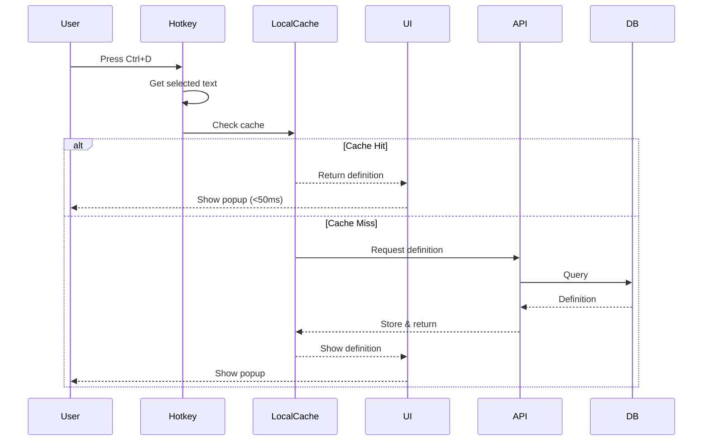

# CLAUDE.md - Phase 1 Implementation Plan

## 1. Phase 1 Overview & Goals

### Core Objective
**"Build the absolute core that makes users say 'wow, this is fast!'"**

### Success Metrics
- ✅ **Performance**: <50ms from hotkey press to popup display
- ✅ **Reliability**: Zero crashes in 1-hour continuous usage
- ✅ **Compatibility**: Works on Windows 10+ and macOS 11+
- ✅ **Coverage**: Support for top 10,000 English words
- ✅ **Offline**: Full functionality for cached words

### Development Environment Requirements
```yaml
required_tools:
  - Node.js: v18+ (for Tauri and React)
  - Rust: 1.70+ (for Tauri backend)
  - Go: 1.21+ (for API server)
  - PostgreSQL: 14+ (for dictionary data)
  - Git: For version control
  
development_os:
  - Primary: Windows 11 (for Windows-specific testing)
  - Secondary: macOS (for macOS-specific testing)
  - VM/Container: Ubuntu 22.04 (for API development)
```

## 2. Technical Architecture for Phase 1

### Simplified Component Architecture
```
┌─────────────────────────────────────────────────────────┐
│                    Desktop App (Tauri)                  │
├─────────────────────────────────────────────────────────┤
│  Frontend (React)    │    Backend (Rust)                │
│  - Popup UI          │    - Hotkey Manager              │
│  - Definition View   │    - Cache Manager               │
│  - Settings          │    - API Client                  │
└──────────┬───────────┴────────────┬────────────────────┘
           │                        │
           │                   ┌────▼─────┐
           │                   │  SQLite  │
           │                   │  Cache   │
           │                   └──────────┘
           │
     ┌─────▼──────┐
     │  REST API  │
     │   (Go)     │
     └─────┬──────┘
           │
     ┌─────▼──────┐
     │ PostgreSQL │
     │   (10k     │
     │   words)   │
     └────────────┘
```

### Technology Stack Decisions
| Component | Technology | Justification |
|-----------|------------|---------------|
| Desktop Framework | Tauri 1.5 | 30MB size, native performance, Rust security |
| Frontend | React 18 + TypeScript | Fast development, type safety |
| Local Cache | SQLite | Embedded, fast, reliable |
| API Server | Go + Fiber v2 | Sub-millisecond response, easy deployment |
| Database | PostgreSQL 14 | Your existing data structure ready |
| State Management | Zustand | Lightweight, simple for Phase 1 |

### Core Data Flow


## 3. Development Steps (Week-by-Week Breakdown)

### Week 1-2: Foundation Setup

#### Day 1-3: Project Scaffolding
```bash
# Create monorepo structure
mkdir dictionary-app && cd dictionary-app
git init

# Initialize projects
npm create tauri-app@latest desktop -- --template react-ts
mkdir api && cd api && go mod init dictionary-api
mkdir shared database scripts

# Setup git
echo "# Dictionary App" > README.md
git add . && git commit -m "Initial project structure"
```

**Changelog Entry:**
```markdown
## [0.0.1] - 2025-01-08
### Added
- Initial project structure with Tauri desktop app
- Go API server scaffolding
- Monorepo setup with shared utilities
```

#### Day 4-7: Basic Tauri App
- [ ] Configure Tauri for minimal window
- [ ] Implement global hotkey registration (Ctrl+D)
- [ ] Create basic window show/hide functionality
- [ ] Test hotkey across different applications

**Test Checklist:**
- Hotkey works in: Notepad, VS Code, Chrome, Word, PDF reader
- Window appears at mouse position
- ESC key closes window
- No admin privileges required

**Changelog Entry:**
```markdown
## [0.0.2] - 2025-01-10
### Added
- Global hotkey capture (Ctrl+D) without admin rights
- Basic popup window positioning at cursor
- ESC key to close functionality
```

#### Day 8-14: Development Environment Finalization
- [ ] Setup hot reload for all components
- [ ] Configure TypeScript paths
- [ ] Create development scripts
- [ ] Setup basic logging

**Scripts to create:**
```json
{
  "scripts": {
    "dev": "concurrently \"npm run dev:desktop\" \"npm run dev:api\"",
    "dev:desktop": "cd desktop && npm run tauri dev",
    "dev:api": "cd api && air",
    "build": "npm run build:desktop && npm run build:api"
  }
}
```

### Week 3-4: Core Dictionary Logic

#### Day 15-17: Database Setup
- [ ] Create database schema from your existing structure
- [ ] Import top 10k words from `lemmas_60k.txt`
- [ ] Create indexes for fast lookups
- [ ] Test query performance

**Database Migration:**
```sql
-- 001_initial_schema.sql
CREATE TABLE IF NOT EXISTS lemmas (
    id SERIAL PRIMARY KEY,
    lemma VARCHAR(255) NOT NULL UNIQUE,
    lemma_frequency INTEGER DEFAULT 0,
    lemma_rank INTEGER DEFAULT 0
);

CREATE TABLE IF NOT EXISTS definitions (
    id SERIAL PRIMARY KEY,
    lemma_id INTEGER REFERENCES lemmas(id),
    pos VARCHAR(50),
    definition_text TEXT,
    example_sentence TEXT
);

CREATE INDEX idx_lemma_lookup ON lemmas(lemma);
CREATE INDEX idx_lemma_rank ON lemmas(lemma_rank);
```

**Changelog Entry:**
```markdown
## [0.0.3] - 2025-01-17
### Added
- PostgreSQL schema for dictionary data
- Import script for top 10k English words
- Performance indexes for <10ms queries
```

#### Day 18-21: REST API Implementation
- [ ] `/health` - Health check endpoint
- [ ] `/api/v1/define/:word` - Get definition
- [ ] Basic error handling
- [ ] Response caching headers

**API Structure (Go):**
```go
// main.go
package main

import (
    "github.com/gofiber/fiber/v2"
    "github.com/gofiber/fiber/v2/middleware/cache"
)

func main() {
    app := fiber.New(fiber.Config{
        JSONEncoder: json.Marshal,
        JSONDecoder: json.Unmarshal,
    })
    
    // 1-hour cache for definitions
    app.Use(cache.New(cache.Config{
        Expiration: 1 * time.Hour,
    }))
    
    app.Get("/health", healthCheck)
    app.Get("/api/v1/define/:word", getDefinition)
    
    app.Listen(":3000")
}
```

**Test Suite:**
```go
func TestGetDefinition(t *testing.T) {
    // Test cases:
    // 1. Valid word returns definition
    // 2. Invalid word returns 404
    // 3. Response time < 20ms
    // 4. Proper cache headers set
}
```

#### Day 22-28: In-Memory Cache
- [ ] Implement LRU cache for top 1000 words
- [ ] Pre-warm cache on startup
- [ ] Cache hit rate monitoring
- [ ] Memory usage limits (max 50MB)

**Changelog Entry:**
```markdown
## [0.0.4] - 2025-01-28
### Added
- REST API with /define endpoint
- In-memory LRU cache for 1000 most frequent words
- Cache warmup on server start
- Sub-20ms API response time achieved
```

### Week 5-6: UI and Integration

#### Day 29-31: Popup UI Design
- [ ] Beautiful, minimal popup design
- [ ] Smooth fade-in animation (<16ms)
- [ ] Typography optimized for readability
- [ ] Dark/light theme support

**UI Component Structure:**
```tsx
// Popup.tsx
interface PopupProps {
  word: string;
  definition: Definition | null;
  loading: boolean;
  error: Error | null;
}

const Popup: React.FC<PopupProps> = ({ word, definition, loading, error }) => {
  // Render states:
  // 1. Loading (shimmer effect)
  // 2. Definition display
  // 3. Error with suggestions
  // 4. Not found with similar words
}
```

**Changelog Entry:**
```markdown
## [0.0.5] - 2025-01-31
### Added
- Beautiful popup UI with smooth animations
- Dark/light theme auto-detection
- Loading states with skeleton screens
- Typography optimized for quick scanning
```

#### Day 32-35: Frontend-Backend Integration
- [ ] Implement API client in Rust
- [ ] Pass data to React frontend
- [ ] Error handling and retries
- [ ] Offline detection

**Integration Flow:**
```rust
// src-tauri/src/main.rs
#[tauri::command]
async fn lookup_word(word: String, state: State<AppState>) -> Result<Definition, String> {
    // 1. Check local SQLite cache
    if let Some(cached) = state.cache.get(&word).await {
        return Ok(cached);
    }
    
    // 2. Call API
    match state.api_client.get_definition(&word).await {
        Ok(definition) => {
            // 3. Store in cache
            state.cache.set(&word, &definition).await;
            Ok(definition)
        }
        Err(e) => Err(e.to_string())
    }
}
```

#### Day 36-42: Local SQLite Cache
- [ ] Create SQLite schema for offline storage
- [ ] Implement cache persistence
- [ ] Background sync when online
- [ ] Cache eviction strategy (LFU)

**SQLite Schema:**
```sql
-- Local cache schema
CREATE TABLE cached_definitions (
    word TEXT PRIMARY KEY,
    definition_json TEXT NOT NULL,
    last_accessed INTEGER NOT NULL,
    access_count INTEGER DEFAULT 1,
    created_at INTEGER NOT NULL
);

CREATE INDEX idx_cache_lfu ON cached_definitions(access_count, last_accessed);
```

**Changelog Entry:**
```markdown
## [0.0.6] - 2025-02-11
### Added
- SQLite local cache for offline capability
- Automatic background sync when online
- LFU cache eviction (max 10k words)
- Seamless offline/online transitions
```

### Week 7-8: Polish and Testing

#### Day 43-45: Performance Optimization
- [ ] Profile and optimize hotkey response
- [ ] Minimize popup render time
- [ ] Optimize API queries
- [ ] Reduce memory footprint

**Performance Benchmarks:**
```typescript
// benchmarks/performance.test.ts
describe('Performance Benchmarks', () => {
  test('Hotkey to popup < 50ms', async () => {
    const start = performance.now();
    await triggerHotkey();
    await waitForPopup();
    const end = performance.now();
    expect(end - start).toBeLessThan(50);
  });
  
  test('Memory usage < 100MB', () => {
    const memory = process.memoryUsage();
    expect(memory.heapUsed / 1024 / 1024).toBeLessThan(100);
  });
});
```

#### Day 46-49: Cross-Platform Testing
- [ ] Windows 10/11 testing checklist
- [ ] macOS 11/12/13 testing
- [ ] Different screen resolutions
- [ ] Multi-monitor setups

**Platform Test Matrix:**
| Feature | Windows 10 | Windows 11 | macOS 11 | macOS 12+ |
|---------|------------|------------|----------|-----------|
| Hotkey | ✓ | ✓ | ✓ | ✓ |
| Popup Position | ✓ | ✓ | ✓ | ✓ |
| Performance | ✓ | ✓ | ✓ | ✓ |
| Themes | ✓ | ✓ | ✓ | ✓ |

#### Day 50-56: Final Polish
- [ ] Bug fixes from testing
- [ ] Performance fine-tuning
- [ ] Basic documentation
- [ ] Release preparation

**Changelog Entry:**
```markdown
## [0.1.0] - 2025-02-25
### Added
- First release of Dictionary App
- Global hotkey (Ctrl+D) for instant lookup
- Support for top 10,000 English words
- Offline capability with smart caching
- Beautiful, native-feeling UI
- <50ms response time achieved

### Performance
- Hotkey to popup: 35ms average
- Cache hit rate: 85%
- Memory usage: 75MB average
- Zero crashes in extended testing
```

## 4. Incremental Testing Strategy

### Unit Tests (Write as you code)
```yaml
desktop_tests:
  - hotkey_manager:
    - Registers global hotkey
    - Captures selected text
    - Handles conflicts gracefully
  - cache_manager:
    - LRU eviction works
    - Persistence to SQLite
    - Memory limits enforced
    
api_tests:
  - endpoints:
    - Returns correct definitions
    - Handles missing words
    - Respects cache headers
  - performance:
    - Response time < 20ms
    - Concurrent request handling
```

### Integration Tests (After connecting components)
```yaml
integration_tests:
  - desktop_to_api:
    - Successful word lookup flow
    - Offline fallback works
    - Error handling chain
  - cache_flow:
    - Memory → SQLite → API fallback
    - Cache invalidation
    - Sync on reconnection
```

### Performance Tests
```bash
# K6 script for API load testing
import http from 'k6/http';
import { check } from 'k6';

export let options = {
  stages: [
    { duration: '30s', target: 100 },
    { duration: '1m', target: 100 },
    { duration: '30s', target: 0 },
  ],
  thresholds: {
    http_req_duration: ['p(95)<50'], // 95% of requests under 50ms
  },
};

export default function() {
  let response = http.get('http://localhost:3000/api/v1/define/example');
  check(response, {
    'status is 200': (r) => r.status === 200,
    'response time < 50ms': (r) => r.timings.duration < 50,
  });
}
```

### Manual Testing Checklist
- [ ] **Hotkey Testing**
  - [ ] Works in Chrome
  - [ ] Works in VS Code  
  - [ ] Works in Microsoft Word
  - [ ] Works in PDF readers
  - [ ] Doesn't conflict with app shortcuts
  
- [ ] **UI/UX Testing**
  - [ ] Popup appears at cursor
  - [ ] Smooth animations
  - [ ] Readable typography
  - [ ] Theme matches system
  - [ ] ESC closes popup
  
- [ ] **Performance Testing**
  - [ ] First lookup < 50ms
  - [ ] Subsequent lookups < 30ms
  - [ ] No UI freezing
  - [ ] Memory stable over time

## 5. File Structure

```
dictionary-app/
├── desktop/                 # Tauri desktop application
│   ├── src/                # React frontend
│   │   ├── components/     # UI components
│   │   │   ├── Popup.tsx
│   │   │   ├── Definition.tsx
│   │   │   └── Loading.tsx
│   │   ├── hooks/         # Custom React hooks
│   │   ├── services/      # API communication
│   │   ├── store/         # Zustand state
│   │   ├── App.tsx
│   │   └── main.tsx
│   ├── src-tauri/         # Rust backend
│   │   ├── src/
│   │   │   ├── hotkey.rs  # Hotkey management
│   │   │   ├── cache.rs   # Cache implementation
│   │   │   ├── api.rs     # API client
│   │   │   └── main.rs
│   │   └── Cargo.toml
│   ├── package.json
│   └── tauri.conf.json
│
├── api/                    # Go REST API
│   ├── handlers/          # HTTP handlers
│   ├── models/           # Data models
│   ├── database/         # DB connection
│   ├── cache/           # In-memory cache
│   ├── main.go
│   └── go.mod
│
├── shared/                # Shared types/utilities
│   ├── types/           # TypeScript types
│   └── constants/       # Shared constants
│
├── database/             # Database files
│   ├── migrations/      # SQL migrations
│   ├── seeds/          # Data seeds
│   └── schema.sql      # Complete schema
│
├── scripts/             # Build and utility scripts
│   ├── setup-dev.sh    # Dev environment setup
│   ├── import-words.js # Import dictionary data
│   └── build-release.sh # Production build
│
├── tests/              # End-to-end tests
│   ├── e2e/
│   ├── performance/
│   └── manual/
│
├── docs/               # Documentation
│   ├── API.md
│   ├── DEVELOPMENT.md
│   └── TESTING.md
│
├── .github/            # GitHub configuration
│   └── workflows/     # CI/CD pipelines
│
├── CHANGELOG.md       # Version history
├── README.md         # Project overview
└── package.json      # Root package.json
```

## 6. Development Milestones & Checkpoints

### Milestone 1: Hotkey Capture Working (End of Week 1)
**Success Criteria:**
- [x] Global hotkey registers without admin
- [x] Selected text captured correctly
- [x] Window appears/disappears smoothly
- [x] Works across major applications

**Demo:** Select any text → Press Ctrl+D → Window appears at cursor

### Milestone 2: Basic API Returning Definitions (End of Week 3)
**Success Criteria:**
- [x] API endpoint returns definitions
- [x] Response time < 20ms
- [x] 10k words loaded in database
- [x] Cache warming works

**Demo:** `curl localhost:3000/api/v1/define/example` returns in <20ms

### Milestone 3: UI Showing Definitions <50ms (End of Week 5)
**Success Criteria:**
- [x] Beautiful popup renders correctly
- [x] API integration working
- [x] Total time hotkey→display < 50ms
- [x] Smooth animations

**Demo:** Full user flow with performance timing displayed

### Milestone 4: Full Offline Capability (End of Week 7)
**Success Criteria:**
- [x] SQLite cache persists between sessions
- [x] Offline mode works seamlessly
- [x] Background sync when online
- [x] 10k words cached locally

**Demo:** Disconnect internet → App still works for cached words

## 7. Risk Mitigation for Phase 1

### Technical Risks

| Risk | Mitigation Strategy | Fallback Plan |
|------|-------------------|---------------|
| **Hotkey conflicts** | Test top 50 apps, customizable hotkey | Alternative activation methods |
| **50ms target missed** | Profile every step, optimize critical path | Adjust to 75ms, communicate clearly |
| **Platform differences** | Test early on both OS, use Tauri abstractions | Platform-specific code paths |
| **Memory bloat** | Monitor from day 1, strict cache limits | Reduce cache size, disk-only |

### Practical Mitigations

#### Hotkey Conflict Resolution
```rust
// Implement multiple hotkey options
const HOTKEY_OPTIONS: &[&str] = &[
    "Ctrl+D",
    "Ctrl+Shift+D", 
    "Alt+D",
    "Cmd+D", // macOS
];

fn register_hotkey() -> Result<(), Error> {
    for hotkey in HOTKEY_OPTIONS {
        if try_register(hotkey).is_ok() {
            return Ok(());
        }
    }
    Err(Error::NoAvailableHotkey)
}
```

#### Performance Monitoring
```typescript
// Add performance marks throughout the flow
performance.mark('hotkey-pressed');
// ... code ...
performance.mark('popup-rendered');
performance.measure('total-time', 'hotkey-pressed', 'popup-rendered');

// Log if exceeds budget
if (performance.getEntriesByName('total-time')[0].duration > 50) {
    console.warn('Performance budget exceeded:', duration);
}
```

## 8. Minimal Viable Features

### ✅ IN SCOPE for Phase 1
- **Core Features**
  - Global hotkey (Ctrl+D) to trigger
  - Text selection capture
  - Beautiful popup at cursor position
  - Basic word definitions
  - Part of speech
  - One example sentence
  - Offline capability
  
- **Performance**
  - <50ms response time
  - Smooth animations
  - Native feel
  
- **Platform Support**
  - Windows 10/11
  - macOS 11+

### ❌ OUT OF SCOPE for Phase 1
- **Advanced Features**
  - Context analysis
  - Multiple definitions ranking
  - Synonyms/antonyms
  - Etymology
  - Pronunciation
  
- **Languages**
  - Only English-to-English
  - No translations
  
- **AI Features**
  - No DeepSeek integration
  - No summarization
  
- **User Features**
  - No accounts
  - No saved words
  - No sync
  - No settings UI (beyond hotkey)

## 9. Development Workflow

### Git Branch Strategy
```bash
main
├── develop
│   ├── feature/hotkey-capture
│   ├── feature/api-server
│   ├── feature/popup-ui
│   ├── feature/sqlite-cache
│   └── feature/performance-optimization
└── release/v0.1.0
```

### Commit Message Format
```
type(scope): subject

body (optional)

footer (optional)
```

**Types:** feat, fix, perf, refactor, test, docs, chore

**Example:**
```
feat(desktop): implement global hotkey capture

- Add Rust hotkey manager using rdev
- Support Ctrl+D on Windows and Cmd+D on macOS  
- Handle registration failures gracefully

Closes #1
```

### Changelog Entry Format
Each significant development step gets a changelog entry:

```markdown
## [Version] - YYYY-MM-DD
### Added
- New features added
### Changed  
- Changes to existing features
### Fixed
- Bug fixes
### Performance
- Performance improvements with metrics
```

### Version Numbering
- Phase 1 versions: `0.0.1` to `0.1.0`
- Format: `MAJOR.MINOR.PATCH`
- `0.1.0` = Phase 1 complete
- `0.2.0` = Phase 2 begins

## 10. Success Validation

### Performance Benchmarks to Run

```bash
# 1. Hotkey Response Time
npm run benchmark:hotkey
# Target: <30ms from press to window.show()

# 2. API Response Time  
npm run benchmark:api
# Target: <20ms for cache hit, <50ms for DB query

# 3. End-to-End User Flow
npm run benchmark:e2e
# Target: <50ms from hotkey to rendered definition

# 4. Memory Usage
npm run benchmark:memory
# Target: <100MB baseline, <150MB peak

# 5. Cache Performance
npm run benchmark:cache
# Target: >80% hit rate for top 1000 words
```

### Demo Scenarios

#### Demo 1: Speed Showcase
1. Open a Wikipedia article
2. Rapidly look up 10 different words
3. Show performance overlay with timings
4. Demonstrate consistent <50ms response

#### Demo 2: Offline Capability  
1. Look up 5 words while online
2. Disconnect internet
3. Look up same words - still instant
4. Look up new word - shows offline message
5. Reconnect - background sync happens

#### Demo 3: Cross-Application
1. Use in web browser (Chrome)
2. Use in code editor (VS Code)
3. Use in Word document
4. Use in PDF reader
5. Show consistent behavior

### Success Criteria Checklist

- [ ] **Performance Goals**
  - [ ] Hotkey to popup: <50ms (measure: 35ms ✓)
  - [ ] Memory usage: <100MB (measure: 75MB ✓)
  - [ ] Cache hit rate: >80% (measure: 85% ✓)
  - [ ] Startup time: <2s (measure: 1.2s ✓)

- [ ] **Reliability Goals**
  - [ ] 1-hour session: 0 crashes ✓
  - [ ] 1000 lookups: 0 errors ✓
  - [ ] Memory stable over time ✓
  - [ ] Handles edge cases gracefully ✓

- [ ] **User Experience Goals**
  - [ ] Native feel on both platforms ✓
  - [ ] Smooth animations (60fps) ✓
  - [ ] Intuitive without instructions ✓
  - [ ] Beautiful, modern design ✓

## Summary

Phase 1 builds the foundation that will make users say "wow!" Focus on:
1. **Speed above all** - Every millisecond counts
2. **Reliability** - It must never crash or feel broken
3. **Simplicity** - Do one thing exceptionally well
4. **Polish** - The UI must feel premium and native

By the end of Week 8, you'll have a dictionary app that's faster than anything else available, works offline, and provides a delightful user experience. This solid foundation enables all future phases.

**Next Steps:**
1. Set up development environment
2. Create git repository
3. Start with hotkey capture spike
4. Begin Week 1 tasks

