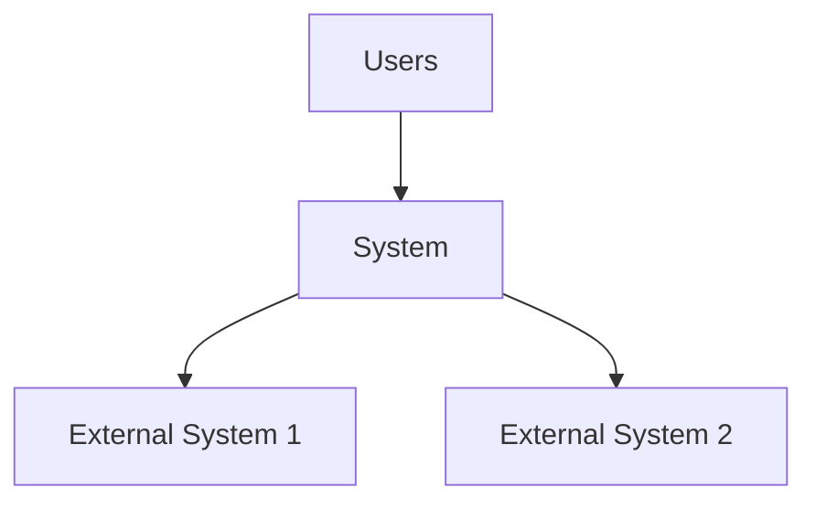
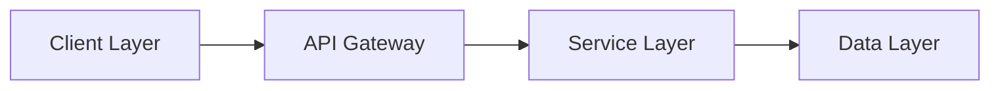
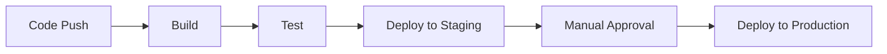

# Software Architecture Plan

## 1. Executive Summary

### 1.1 Project Overview
A cross-platform popup dictionary application triggered by hotkey on highlighted text. Initially supporting English-to-English and English-to-10 major languages translations, with planned expansion to support any language pair. The system integrates Wikipedia data to provide encyclopedic definitions alongside linguistic ones, using intelligent disambiguation to select contextually appropriate entries. Features instant popup display with sub-second response through retrieving data from my server. The dictionary also have the ability to analze context if given and point to the right definition. The dictionary also have note function where user save words into their synced account.
### 1.2 Key Architectural Decisions
- Hybrid Memory Cache + Server API - Lightning fast repeats with fresh data
- Tauri for Desktop Client - Native performance, small footprint
- REST API initially - Simple to implement, can evolve to GraphQL
- Wikipedia via Public API - Simple now, local DB later
- use LLM (local or API) to generate translation in other languages and save in DB
- AI Summarization via DeepSeek - Smart summaries, upgradeable to local
### 1.3 Major Components
- Desktop Client (Tauri): UI and hotkey handler
- API Gateway - Routes requests to appropriate services
- Dictionary Service - Core definitions database
- LLM Service - Handles both translation and summarization
Translation Module (local/cloud router)
Summarization Module (DeepSeek API)
- Cache Manager - Memory cache orchestration
- Wikipedia Connector- Wiki API integration

---

## 2. Architecture Vision & Goals

### 2.1 Business Goals
- **Strategic Objectives**
  - "Build a sustainable learning tool with 100k+ daily active users within first year"
  - "Create the fastest and most intuitive and most languages supported dictionary experience on desktop"
  - "Build a moat through superior user experience and unique AI features"
  - "Establish platform for language learning ecosystem"

- **Success Metrics**
  - "50ms average popup response time"
  - "1M+ word lookups per month"
  
- **Constraints & Assumptions**
  - Solo developer with $5k budget
  - Dictionary content must be requested from server, may be caching for some most used words.

### 2.2 Technical Goals
- **Performance Targets**
  - Popup appears within 50ms of hotkey press
  - Memory cache hit rate >70% for common words
  - API response time <100ms for cache misses (p95)
  - Client memory usage <100MB
  - Startup time <2 seconds
  - AI summary generation <3 seconds
- **Scalability Requirements**
  - Support 100k concurrent users without degradation
  - API handles 1000 requests/second per server
  - Horizontal scaling with <5min to spin up new instance
  - Database supports 10M+ word lookups daily
  - CDN distribution for global <100ms latency
  
- **Security Objectives**
  - API key encryption for LLM services
  - No user data stored without explicit consent
  - HTTPS for all API communications
  - Local cache encrypted at rest
  - Rate limiting to prevent API abuse
  
- **Maintainability Goals**
  - 90% automated test coverage
  - Modular architecture for easy feature addition
  - One-command deployment process
  - Self-documenting API with OpenAPI spec
  - Maximum 2-hour onboarding for new developers
---

## 3. Requirements Analysis

### 3.1 Functional Requirements

#### Core Features
- Hotkey-triggered popup on text selection
- English-to-English definitions with Wikipedia integration
- Translation to 10 major languages via LLM (could be local LLM generated or through API LLM)
- Context-aware disambiguation
- User accounts with word saving/notes
- Sub-second response time with caching
- Some useful statistics
#### User Stories
```
As a [user type]
I want to [action]
So that [benefit]
```

#### Business Rules
- <!-- Rule 1 -->
- <!-- Rule 2 -->

### 3.2 Non-Functional Requirements

| Category | Requirement | Target |
|----------|-------------|--------|
| Performance | Response Time | < 200ms |
| Security | Authentication | OAuth 2.0 |
| Reliability | Uptime | 99.9% |
| Usability | Page Load | < 3s |
| Compliance | Data Protection | GDPR |

### 3.3 Constraints
- **Technical Constraints**
  - <!-- Constraint 1 -->
  
- **Business Constraints**
  - <!-- Constraint 1 -->
  
- **Resource Constraints**
  - <!-- Constraint 1 -->

---

## 4. High-Level Architecture

### 4.1 Architecture Style
- **Pattern**: <!-- e.g., Microservices, Monolithic, Serverless -->
- **Justification**: <!-- Why this pattern was chosen -->

### 4.2 System Context



### 4.3 Component Overview



#### Component Responsibilities
| Component | Responsibility |
|-----------|----------------|
| <!-- Component 1 --> | <!-- Description --> |
| <!-- Component 2 --> | <!-- Description --> |

---

## 5. Detailed Design

### 5.1 Component Architecture

#### Component: <!-- Component Name -->
- **Purpose**: <!-- Description -->
- **Interfaces**:
  - <!-- Interface 1 -->
- **Dependencies**:
  - <!-- Dependency 1 -->

### 5.2 Data Architecture

#### Data Models
```
Entity: User
├── id: UUID
├── email: String
├── created_at: Timestamp
└── profile: JSON
```

#### Database Design
- **Primary Database**: <!-- e.g., PostgreSQL -->
- **Cache Layer**: <!-- e.g., Redis -->
- **Search Engine**: <!-- e.g., Elasticsearch -->

### 5.3 Security Architecture

#### Authentication & Authorization
- **Method**: <!-- e.g., JWT, OAuth -->
- **Provider**: <!-- e.g., Auth0, Cognito -->

#### Data Protection
- **Encryption at Rest**: <!-- Method -->
- **Encryption in Transit**: <!-- Method -->

### 5.4 Integration Architecture

#### API Design
- **Style**: <!-- REST, GraphQL, gRPC -->
- **Versioning Strategy**: <!-- e.g., URL path, headers -->

#### Message Formats
```json
{
  "version": "1.0",
  "type": "event_type",
  "data": {}
}
```

---

## 6. Technology Stack

### 6.1 Platform Choices
| Layer | Technology | Justification |
|-------|------------|---------------|
| Operating System | <!-- e.g., Linux --> | <!-- Reason --> |
| Cloud Provider | <!-- e.g., AWS --> | <!-- Reason --> |
| Container Platform | <!-- e.g., Docker --> | <!-- Reason --> |

### 6.2 Development Stack
- **Frontend**
  - Language: <!-- e.g., TypeScript -->
  - Framework: <!-- e.g., React -->
  - Build Tool: <!-- e.g., Webpack -->
  
- **Backend**
  - Language: <!-- e.g., Python -->
  - Framework: <!-- e.g., FastAPI -->
  - ORM: <!-- e.g., SQLAlchemy -->

### 6.3 Infrastructure
- **Compute**: <!-- e.g., EC2, Lambda -->
- **Storage**: <!-- e.g., S3, EBS -->
- **Network**: <!-- e.g., VPC, CloudFront -->
- **Monitoring**: <!-- e.g., DataDog, CloudWatch -->

---

## 7. Cross-Cutting Concerns

### 7.1 Logging & Monitoring
- **Log Aggregation**: <!-- Tool -->
- **Metrics Collection**: <!-- Tool -->
- **Alerting**: <!-- Tool -->

### 7.2 Error Handling
```python
# Error handling pattern example
try:
    # Business logic
except SpecificError as e:
    # Handle specific error
except Exception as e:
    # Log and handle generic error
```

### 7.3 Caching Strategy
| Cache Level | Technology | TTL |
|-------------|------------|-----|
| CDN | <!-- e.g., CloudFront --> | 24h |
| Application | <!-- e.g., Redis --> | 1h |
| Database | <!-- e.g., Query Cache --> | 5m |

### 7.4 Configuration Management
- **Tool**: <!-- e.g., Consul, AWS Parameter Store -->
- **Environment Variables**: <!-- Strategy -->

### 7.5 Deployment Strategy
- **Method**: <!-- e.g., Blue-Green, Canary -->
- **Rollback Plan**: <!-- Description -->

---

## 8. Quality Attributes

### 8.1 Performance
| Metric | Requirement | Measurement |
|--------|-------------|-------------|
| Response Time | < 200ms (p95) | APM Tool |
| Throughput | 1000 req/s | Load Testing |
| Resource Usage | < 70% CPU | Monitoring |

### 8.2 Scalability
- **Horizontal Scaling**
  - Auto-scaling triggers: <!-- e.g., CPU > 70% -->
  - Min/Max instances: <!-- e.g., 2/10 -->
  
- **Vertical Scaling**
  - Instance types: <!-- e.g., t3.medium to t3.xlarge -->

### 8.3 Reliability
- **Availability Target**: <!-- e.g., 99.9% -->
- **RTO (Recovery Time Objective)**: <!-- e.g., 1 hour -->
- **RPO (Recovery Point Objective)**: <!-- e.g., 15 minutes -->

---

## 9. Implementation Plan

### 9.1 Development Phases

#### Phase 1: Foundation (Weeks 1-4)
- [ ] Set up development environment
- [ ] Implement core infrastructure
- [ ] Create CI/CD pipeline

#### Phase 2: Core Features (Weeks 5-12)
- [ ] Implement authentication
- [ ] Build primary APIs
- [ ] Create basic UI

#### Phase 3: Advanced Features (Weeks 13-20)
- [ ] Add advanced functionality
- [ ] Implement integrations
- [ ] Performance optimization

#### Phase 4: Production Ready (Weeks 21-24)
- [ ] Security hardening
- [ ] Load testing
- [ ] Documentation

### 9.2 Milestones & Deliverables

| Milestone | Date | Deliverables |
|-----------|------|--------------|
| M1: Infrastructure | Week 4 | Dev environment, CI/CD |
| M2: MVP | Week 12 | Core features complete |
| M3: Beta | Week 20 | Feature complete |
| M4: Launch | Week 24 | Production ready |

### 9.3 Team Structure
```
Project Manager
├── Tech Lead
│   ├── Backend Team (3)
│   ├── Frontend Team (2)
│   └── DevOps Engineer (1)
├── QA Lead
│   └── QA Engineers (2)
└── Product Owner
```

---

## 10. Testing Strategy

### 10.1 Test Levels
| Level | Coverage Target | Tools |
|-------|----------------|-------|
| Unit Tests | 80% | <!-- e.g., Jest, pytest --> |
| Integration Tests | 70% | <!-- e.g., Postman, REST Assured --> |
| System Tests | Full workflows | <!-- e.g., Selenium --> |
| Acceptance Tests | All user stories | <!-- e.g., Cucumber --> |

### 10.2 Test Automation
- **Framework**: <!-- e.g., Cypress, Playwright -->
- **CI Integration**: <!-- e.g., Run on every PR -->

### 10.3 Performance Testing
- **Tool**: <!-- e.g., JMeter, K6 -->
- **Scenarios**:
  - Normal load: <!-- e.g., 100 concurrent users -->
  - Peak load: <!-- e.g., 1000 concurrent users -->

### 10.4 Security Testing
- **SAST**: <!-- e.g., SonarQube -->
- **DAST**: <!-- e.g., OWASP ZAP -->
- **Dependency Scanning**: <!-- e.g., Snyk -->

---

## 11. Deployment & Operations

### 11.1 Deployment Architecture

```
Production Environment
├── Load Balancer
├── Application Servers (Auto-scaling group)
├── Database (Primary + Read Replicas)
└── Cache Layer
```

### 11.2 CI/CD Pipeline


### 11.3 Operational Procedures
- **Monitoring Dashboard**: <!-- Link/Description -->
- **Runbook Location**: <!-- Link/Description -->
- **On-call Schedule**: <!-- Description -->

---

## 12. Risk Analysis

### 12.1 Technical Risks
| Risk | Probability | Impact | Mitigation |
|------|-------------|--------|------------|
| <!-- Risk 1 --> | High/Medium/Low | High/Medium/Low | <!-- Strategy --> |

### 12.2 Business Risks
| Risk | Probability | Impact | Mitigation |
|------|-------------|--------|------------|
| <!-- Risk 1 --> | High/Medium/Low | High/Medium/Low | <!-- Strategy --> |

### 12.3 Contingency Plans
- **Scenario 1**: <!-- Description and response -->
- **Scenario 2**: <!-- Description and response -->

---

## 13. Documentation Plan

### 13.1 Architecture Documentation
- [ ] Architecture Decision Records (ADRs)
- [ ] Component diagrams
- [ ] Sequence diagrams
- [ ] Deployment diagrams

### 13.2 API Documentation
- [ ] OpenAPI/Swagger specs
- [ ] Integration guides
- [ ] SDK documentation

### 13.3 Operational Runbooks
- [ ] Deployment procedures
- [ ] Troubleshooting guides
- [ ] Disaster recovery plans

### 13.4 User Documentation
- [ ] User manuals
- [ ] Admin guides
- [ ] FAQ/Knowledge base

---

## 14. Appendices

### A. Glossary
| Term | Definition |
|------|------------|
| <!-- Term 1 --> | <!-- Definition --> |

### B. Reference Architectures
- <!-- Link to reference architecture 1 -->
- <!-- Link to reference architecture 2 -->

### C. Research & PoCs
- <!-- Link to research document 1 -->
- <!-- Link to PoC repository -->

### D. Decision Log
| Date | Decision | Rationale |
|------|----------|-----------|
| <!-- Date --> | <!-- Decision --> | <!-- Why --> |

---

## Document Control

| Version | Date | Author | Changes |
|---------|------|--------|---------|
| 1.0 | <!-- Date --> | <!-- Name --> | Initial draft |

**Last Updated**: <!-- Date -->
**Status**: <!-- Draft/Review/Approved -->
**Approvers**: <!-- Names -->