# Software Architecture Plan - Popup Dictionary

## 1. Executive Summary

### 1.1 Project Overview
A cross-platform popup dictionary application triggered by hotkey on highlighted text. Initially supporting English-to-English and English-to-10 major languages translations, with planned expansion to support any language pair. The system integrates Wikipedia data to provide encyclopedic definitions alongside linguistic ones, using intelligent disambiguation to select contextually appropriate entries. Features instant popup display with sub-second response through retrieving data from server. The dictionary also has the ability to analyze context if given and point to the right definition. The dictionary also has note function where users save words into their synced account.

### 1.2 Key Architectural Decisions
1. **Hybrid Memory Cache + Server API** - Lightning fast repeats with fresh data
2. **Tauri for Desktop Client** - Native performance, small footprint, enables <30ms popup
3. **REST API with WebSocket fallback** - Simple start, real-time updates for sync
4. **Edge caching with CDN** - Global <50ms response times
5. **Predictive prefetching** - ML-based cache warming for zero-latency feel
6. **Context Analysis via BERT-lite** - Lightweight NLP for instant context understanding
7. **Async Wikipedia loading** - Non-blocking UI with progressive enhancement
8. **Optimistic UI updates** - Show cached content immediately, update if needed

### 1.3 Major Components
1. **Desktop Client (Tauri)** - Native UI with Rust performance core
2. **API Gateway** - Smart routing with request coalescing
3. **Dictionary Service** - Core definitions with intelligent caching layer
4. **Context Analyzer** - BERT-based definition ranking service
5. **Cache Orchestra** - Multi-tier cache management (Memory → Local → CDN → Origin)
6. **Sync Engine** - CRDT-based conflict-free note synchronization
7. **AI Service** - DeepSeek integration with response caching
8. **Wikipedia Connector** - Async fetch with smart summary extraction
9. **Performance Monitor** - Real-time latency tracking and optimization

---

## 2. Architecture Vision & Goals

### 2.1 Business Goals
- **Strategic Objectives**
  - Build a sustainable learning tool with 100k+ daily active users 
  - Create the fastest and most intuitive and most languages supported dictionary experience on desktop
  - Build competitive advantage through superior performance and UX
  - Establish platform for language learning ecosystem
  
- **Success Metrics**
  - <30ms popup display time (p95)
  - 1M+ word lookups per month
  - >80% cache hit rate
  - <1% error rate
  
- **Constraints & Assumptions**
  - Dictionary content must be requested from server
  - Users expect instant response (any delay feels broken)
  - Network latency is primary enemy of user experience

### 2.2 Technical Goals
- **Performance Targets**
  - Popup render: <30ms from hotkey press
  - First definition display: <50ms (cached) or <150ms (network)
  - Memory cache hit rate: >80% for top 10k words
  - Client memory usage: <100MB baseline, <200MB peak
  - Zero UI blocking - all network calls async
  - 60fps animations without frame drops
  
- **Scalability Requirements**
  - Support 100k concurrent users without degradation
  - Horizontal API scaling with sticky sessions for user state
  - Database read replicas in 3+ regions
  - CDN presence in 20+ edge locations
  - Auto-scale triggers at 70% CPU or memory
  
- **Security Objectives**
  - End-to-end encryption for user notes
  - JWT with refresh tokens (15min/7day expiry)
  - API rate limiting: 50 req/min per user
  - DDoS protection via CloudFlare
  - Zero-trust architecture for internal services
  
- **Maintainability Goals**
  - Modular plugin architecture for feature extensions
  - Feature flags for gradual rollout
  - Automated E2E tests for critical paths
  - Performance regression alerts
  - One-click rollback capability

---

## 3. Requirements Analysis

### 3.1 Functional Requirements

#### Core Features
- [x] Global hotkey activation with customizable binding
- [x] Sub-50ms popup display with GPU acceleration
- [x] Context-aware definition ranking using surrounding 50 words
- [x] Clickable word cross-references with instant navigation
- [x] Multilingual support with pre-generated translations
- [x] Progressive Wikipedia loading (title → summary → full)
- [x] Offline-first with background sync
- [x] Personal note collection with CRDT sync
- [x] AI summarization with 3-second timeout

#### User Stories
```
As a speed reader
I want instant definitions that appear in <50ms
So that I can maintain my reading flow without interruption
```

```
As a researcher encountering polysemous words
I want to highlight context and get AI-suggested definitions
So that I quickly find the relevant meaning without scrolling
```

```
As a multilingual professional
I want definitions displayed in my preferred language
So that I can fully grasp nuanced meanings
```

```
As a student preparing for exams
I want to save words and sync across devices
So that I can review them anywhere
```

#### Business Rules
**Performance Rules:**
- Popup must render within 30ms or show loading state
- Cache top 5k English words in memory 
- Prefetch definitions for words near cursor
- Network timeouts: 100ms (cache check), 500ms (API), 3s (AI)

**Definition Display Rules:**
- Show 1 most common definition per POS initially
- Lazy-load additional definitions on expansion
- Hypernym boxes rendered as clickable chips
- Maximum 5 synonyms displayed inline

**Cache Strategy Rules:**
- L1: Memory cache (10k words, LRU eviction)
- L2: Disk cache (100k words, 7-day TTL)
- L3: CDN cache (1M words, 24-hour TTL)
- Cache invalidation via version headers

**AI Feature Rules:**
- Trigger summary for selections >50 words
- 200-word response limit for performance
- Cache AI responses for 24 hours
- Fallback to simple extraction if AI fails

### 3.2 Non-Functional Requirements

| Category | Requirement | Target | Implementation |
|----------|-------------|--------|----------------|
| Performance | Hotkey → Popup | <30ms | GPU-accelerated rendering |
| Performance | Cache Hit Rate | >80% | Predictive prefetching |
| Performance | API Response | <100ms (p95) | Edge computing |
| Latency | Global Response | <150ms | Multi-region deployment |
| Reliability | Uptime | 99.5% | Health checks + auto-restart |
| Scalability | Concurrent Users | 100k | Horizontal pod autoscaling |
| Security | Data Encryption | AES-256 | At rest and in transit |
| Compatibility | OS Support | Win 10+, macOS 11+ | Platform-specific builds |
| Resource | Memory Usage | <200MB | Aggressive cache limits |

### 3.3 Constraints

**Technical Constraints**
- Must intercept global hotkeys without admin privileges
- Cannot block UI thread for >16ms (60fps requirement)
- WebView2 (Windows) and WKWebView (macOS) limitations
- Maximum 1000 WebSocket connections per server

**Performance Constraints**
- Every user interaction must feel instant (<100ms)
- No spinners for operations <500ms
- Graceful degradation when offline

**Infrastructure Constraints**
- Initial budget $500/month for servers
- Must handle viral traffic spikes (10x normal)
- CDN bandwidth costs must scale linearly

**Development Constraints**
- Backward compatibility for sync protocol
- A/B testing framework required


## 4. High-Level Architecture

### 4.1 Architecture Style
- **Pattern**: Microservices with Event-Driven Communication
- **Justification**: 
  - Independent scaling of high-traffic services (definitions vs AI)
  - Fault isolation - AI service failure doesn't break core dictionary
  - Technology flexibility - can use optimal stack per service
  - Enables gradual migration from monolith as we grow

### 4.2 System Context

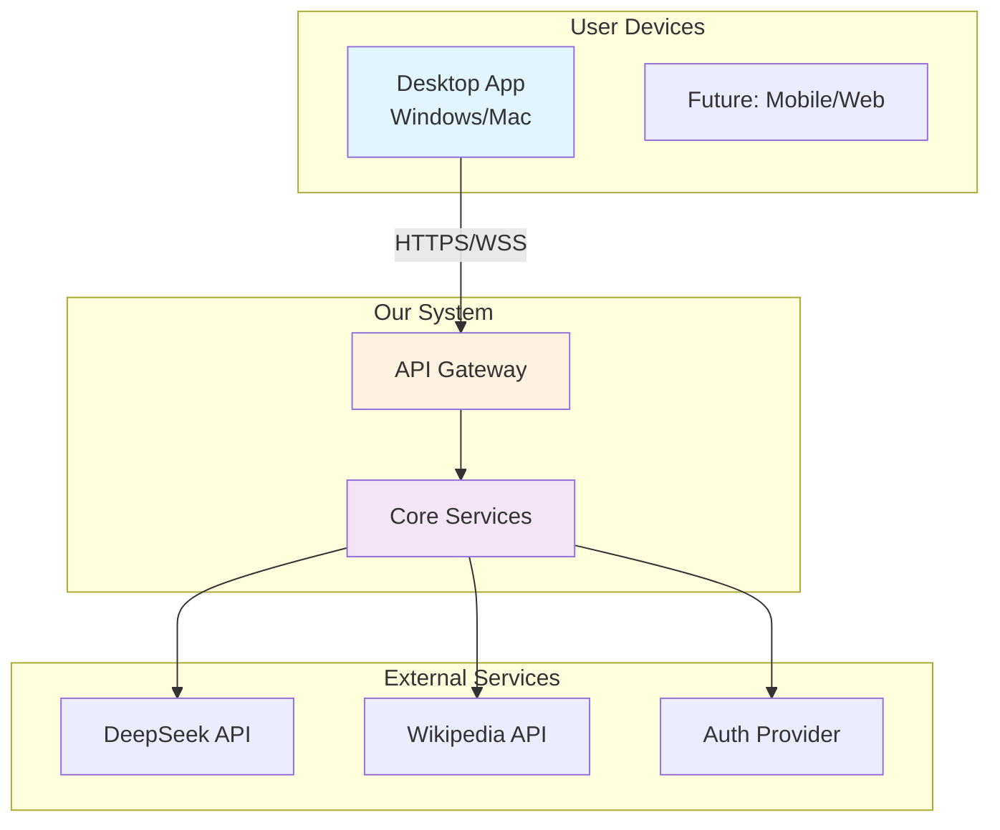

### 4.3 Component Overview

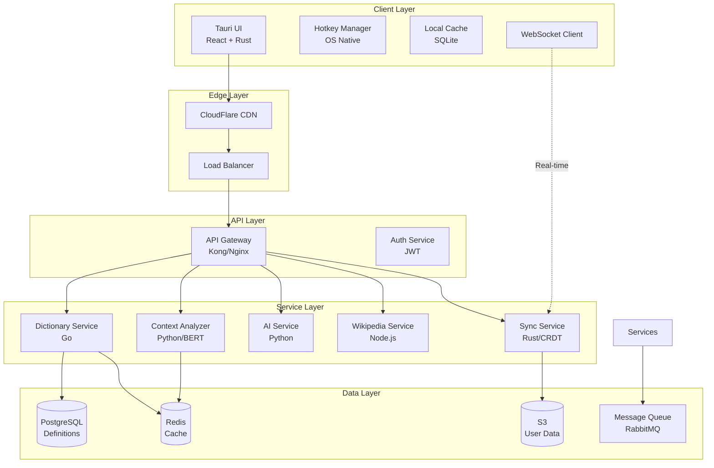

### 4.4 Component Details

#### 4.4.1 Client Components

| Component | Technology | Responsibility | Performance Target |
|-----------|------------|----------------|-------------------|
| **Tauri UI** | Rust + React | Native window, rendering, interactions | <16ms frame time |
| **Hotkey Manager** | OS Native APIs | Global hotkey capture, text selection | <5ms response |
| **Local Cache** | SQLite + Memory | Store definitions, user data | <1ms read |
| **WebSocket Client** | Rust | Real-time sync, live updates | <50ms latency |

#### 4.4.2 Edge Layer

| Component | Technology | Responsibility | Performance Target |
|-----------|------------|----------------|-------------------|
| **CDN** | CloudFlare | Static assets, API cache | <30ms globally |
| **Load Balancer** | AWS ALB | Request distribution, SSL termination | <5ms overhead |

#### 4.4.3 Service Layer

| Component | Technology | Responsibility | Performance Target |
|-----------|------------|----------------|-------------------|
| **Dictionary Service** | Go + Fiber | Core definitions, search | <20ms response |
| **Context Analyzer** | Python + FastAPI | BERT inference, ranking | <50ms analysis |
| **AI Service** | Python + Celery | DeepSeek integration | <3s generation |
| **Wikipedia Service** | Node.js + Cache | Wiki API, extraction | <500ms fetch |
| **Sync Service** | Rust + Tokio | CRDT sync, conflicts | <100ms sync |

### 4.5 Data Flow Scenarios

#### 4.5.1 Instant Popup Flow (Cache Hit)
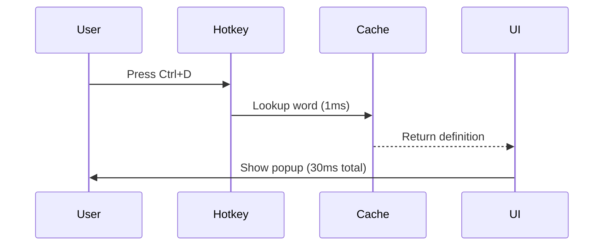

#### 4.5.2 Network Lookup Flow (Cache Miss)
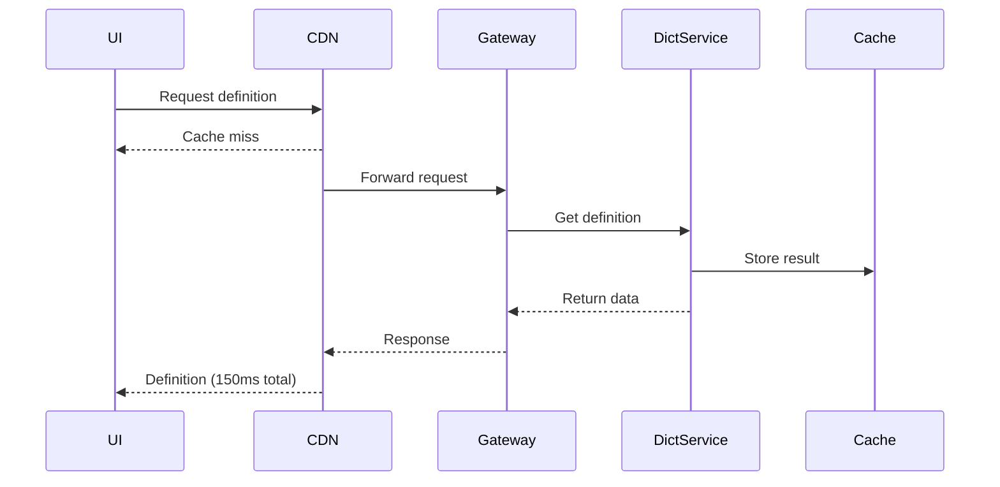

#### 4.5.3 Context-Aware Flow
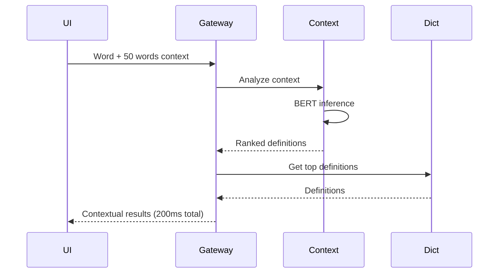

### 4.6 Deployment Architecture

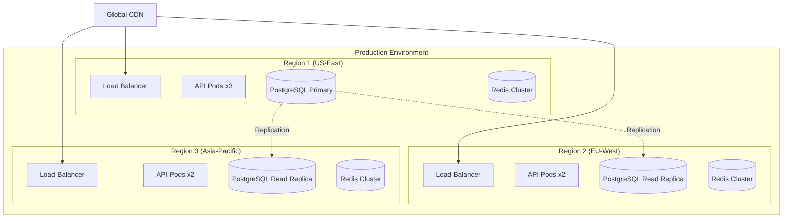

### 4.7 Technology Stack Summary

| Layer | Technology | Justification |
|-------|------------|---------------|
| **Desktop Client** | Tauri (Rust + React) | Native performance, small size (30MB vs 150MB Electron) |
| **API Gateway** | Kong or Nginx | Battle-tested, plugin ecosystem |
| **Core Services** | Go | Fast, efficient, great concurrency |
| **ML Services** | Python | Best ML library support |
| **Database** | PostgreSQL | Full-text search, JSON support |
| **Cache** | Redis | Sub-millisecond latency |
| **Message Queue** | RabbitMQ | Reliable async processing |
| **CDN** | CloudFlare | Global presence, good free tier |
| **Monitoring** | Prometheus + Grafana | Open source, powerful |

### 4.8 Key Architecture Decisions Explained

1. **Why Microservices?**
   - Dictionary service can scale independently from AI service
   - Can use optimal language per service (Go for speed, Python for ML)
   - Failure isolation - AI timeout doesn't break core dictionary

2. **Why Event-Driven?**
   - Async processing for heavy operations (AI, translation)
   - Enables real-time features (collaborative notes)
   - Better handling of traffic spikes

3. **Why Multi-Region?**
   - Global <150ms response times
   - Data sovereignty compliance
   - Disaster recovery built-in

4. **Why CRDT for Sync?**
   - Conflict-free by design
   - Works offline
   - No central coordination needed
---
## 5. Detailed Design

### 5.1 Component Architecture

#### Component: Dictionary Service
- **Purpose**: Core service providing word definitions with sub-50ms response time
- **Interfaces**:
  - REST API: `GET /api/v1/define/{word}`
  - REST API: `POST /api/v1/define/context` (with context analysis)
  - gRPC: Internal service-to-service communication
- **Dependencies**:
  - PostgreSQL (primary data store)
  - Redis (caching layer)
  - Context Analyzer Service (for ranked definitions)

#### Component: Context Analyzer Service
- **Purpose**: BERT-based NLP service that ranks definitions by context relevance
- **Interfaces**:
  - gRPC: `AnalyzeContext(word, surrounding_text) -> RankedDefinitions`
  - REST API: `POST /api/v1/context/analyze` (backup)
- **Dependencies**:
  - Pre-trained BERT model (DistilBERT for speed)
  - Redis (model cache)
  - Dictionary Service (definition lookup)

#### Component: Client Cache Manager
- **Purpose**: Multi-tier cache orchestration for instant popup experience
- **Interfaces**:
  - Internal API: `CacheManager.get(word) -> Definition`
  - Internal API: `CacheManager.prefetch(words[])`
  - Events: `CacheHit`, `CacheMiss`, `CacheEviction`
- **Dependencies**:
  - In-memory store (HashMap with LRU)
  - SQLite (persistent cache)
  - Network layer (fallback)

#### Component: Sync Service
- **Purpose**: CRDT-based synchronization for user notes and preferences
- **Interfaces**:
  - WebSocket: Real-time sync protocol
  - REST API: `POST /api/v1/sync/changes`
  - REST API: `GET /api/v1/sync/state/{user_id}`
- **Dependencies**:
  - PostgreSQL (event store)
  - Redis (session state)
  - S3 (large object storage)

### 5.2 Data Architecture

#### Data Models

```
Entity: Word
├── id: UUID
├── lemma: String (indexed)
├── language: String
├── frequency_rank: Integer
├── created_at: Timestamp
└── updated_at: Timestamp

Entity: Definition
├── id: UUID
├── word_id: UUID (FK)
├── pos: String (part of speech)
├── definition_text: Text
├── example: Text
├── hypernyms: String[]
├── frequency_score: Float
├── context_tags: String[]
└── source: String

Entity: User
├── id: UUID
├── email: String (unique)
├── preferences: JSON
├── created_at: Timestamp
└── last_sync: Timestamp

Entity: UserNote
├── id: UUID
├── user_id: UUID (FK)
├── word_id: UUID (FK)
├── note_text: Text
├── context: Text
├── created_at: Timestamp
├── updated_at: Timestamp
└── sync_version: Integer (CRDT)

Entity: LookupHistory
├── id: UUID
├── user_id: UUID (FK)
├── word_id: UUID (FK)
├── context: Text
├── source_app: String
├── lookup_time: Timestamp
└── response_time_ms: Integer
```

#### Database Design
- **Primary Database**: PostgreSQL 14+
  - Full-text search with GIN indexes
  - JSONB for flexible data
  - Partitioning for history tables
- **Cache Layer**: Redis 7+
  - Memory cache for hot words (10k entries)
  - Sorted sets for frequency rankings
  - Pub/sub for cache invalidation
- **Search Engine**: PostgreSQL FTS (initially)
  - Built-in full-text search
  - Upgrade path to Elasticsearch if needed

### 5.3 Security Architecture

#### Authentication & Authorization
- **Method**: JWT with refresh tokens
  - Access token: 15 minutes
  - Refresh token: 7 days
  - Token rotation on refresh
- **Provider**: Self-hosted initially, Auth0 ready
  - JWT signing with RS256
  - Rate limiting per user
  - Device fingerprinting

#### Data Protection
- **Encryption at Rest**: 
  - AES-256-GCM for user notes
  - Transparent disk encryption for databases
  - Client-side encryption for sensitive data
- **Encryption in Transit**:
  - TLS 1.3 minimum
  - Certificate pinning in client
  - Perfect forward secrecy

### 5.4 Integration Architecture

#### API Design
- **Style**: REST with GraphQL planned
  - REST for simple CRUD operations
  - GraphQL for complex queries (future)
  - gRPC for internal services
- **Versioning Strategy**: URL path versioning
  - `/api/v1/` current version
  - Deprecation warnings in headers
  - 6-month deprecation cycle

#### Message Formats

```json
// Request Format
{
  "version": "1.0",
  "request_id": "550e8400-e29b-41d4-a716-446655440000",
  "timestamp": "2024-01-01T00:00:00Z",
  "data": {
    "word": "example",
    "context": "50 words of surrounding text...",
    "options": {
      "include_etymology": false,
      "max_definitions": 3
    }
  }
}

// Response Format
{
  "version": "1.0",
  "request_id": "550e8400-e29b-41d4-a716-446655440000",
  "timestamp": "2024-01-01T00:00:01Z",
  "response_time_ms": 47,
  "data": {
    "word": "example",
    "definitions": [...],
    "cache_hit": true
  },
  "metadata": {
    "server_region": "us-east-1",
    "cache_age_seconds": 3600
  }
}

// Event Format (Async)
{
  "version": "1.0",
  "event_type": "definition.viewed",
  "timestamp": "2024-01-01T00:00:00Z",
  "user_id": "user_123",
  "data": {
    "word_id": "word_456",
    "source": "desktop_app",
    "response_time_ms": 32
  }
}
```

---

## 6. Technology Stack

### 6.1 Platform Choices
| Layer | Technology | Justification |
|-------|------------|---------------|
| Operating System | Ubuntu 22.04 LTS | Stability, wide support, security updates |
| Cloud Provider | AWS initially | Most mature, easy migration path |
| Container Platform | Docker + K8s | Industry standard, great tooling |
| Service Mesh | Istio (future) | Traffic management, observability |

### 6.2 Development Stack

- **Frontend (Desktop Client)**
  - Language: TypeScript + Rust
  - Framework: React 18 + Tauri
  - State Management: Zustand (lightweight)
  - Build Tool: Vite (fast builds)
  - Testing: Vitest + Playwright

- **Backend Services**
  - **Dictionary Service**:
    - Language: Go 1.21
    - Framework: Fiber v2 (fast HTTP)
    - ORM: sqlx (performance)
  - **AI/Context Service**:
    - Language: Python 3.11
    - Framework: FastAPI
    - ML: PyTorch + Transformers
  - **Sync Service**:
    - Language: Rust
    - Framework: Axum
    - CRDT: automerge-rs

### 6.3 Infrastructure
- **Compute**: 
  - EC2 (API servers): t3.medium initially
  - ECS Fargate (services): Auto-scaling
  - Lambda (AI inference): Cost optimization
- **Storage**:
  - S3: User data, backups
  - EBS: Database volumes (gp3)
  - EFS: Shared model storage
- **Network**:
  - VPC: Multi-AZ deployment
  - CloudFront: Global CDN
  - Route 53: DNS + health checks
- **Monitoring**:
  - CloudWatch: Basic metrics
  - Prometheus: Detailed metrics
  - Grafana: Visualization
  - Sentry: Error tracking

---

## 7. Cross-Cutting Concerns

### 7.1 Logging & Monitoring
- **Log Aggregation**: 
  - CloudWatch Logs (initially)
  - ELK stack (future)
  - Structured JSON logging
- **Metrics Collection**:
  - Prometheus format
  - Custom business metrics
  - Performance histograms
- **Alerting**:
  - PagerDuty integration
  - Slack notifications
  - Escalation policies

### 7.2 Error Handling

```python
# Python services error handling
from typing import Optional
import logging
from fastapi import HTTPException

class DictionaryError(Exception):
    """Base exception for dictionary service"""
    pass

class WordNotFoundError(DictionaryError):
    """Raised when word is not in dictionary"""
    pass

async def get_definition(word: str) -> dict:
    try:
        # Try cache first
        cached = await redis_client.get(f"def:{word}")
        if cached:
            return json.loads(cached)
        
        # Database lookup
        definition = await db.fetch_definition(word)
        if not definition:
            raise WordNotFoundError(f"Word '{word}' not found")
            
        # Cache for next time
        await redis_client.setex(
            f"def:{word}", 
            3600, 
            json.dumps(definition)
        )
        return definition
        
    except WordNotFoundError:
        # Return helpful suggestions
        suggestions = await get_similar_words(word)
        raise HTTPException(
            status_code=404,
            detail={
                "error": "word_not_found",
                "word": word,
                "suggestions": suggestions
            }
        )
    except RedisError as e:
        # Log but don't fail
        logging.warning(f"Cache error: {e}")
        # Fallback to database
        return await db.fetch_definition(word)
    except Exception as e:
        logging.error(f"Unexpected error: {e}")
        raise HTTPException(
            status_code=500,
            detail="Internal server error"
        )
```

```go
// Go services error handling
type Error struct {
    Code    string `json:"code"`
    Message string `json:"message"`
    Details any    `json:"details,omitempty"`
}

func (s *DictionaryService) GetDefinition(ctx context.Context, word string) (*Definition, error) {
    // Context timeout
    ctx, cancel := context.WithTimeout(ctx, 100*time.Millisecond)
    defer cancel()
    
    // Try cache with circuit breaker
    if def, err := s.cache.Get(ctx, word); err == nil {
        return def, nil
    } else if err != ErrCacheMiss {
        // Log cache errors but continue
        log.Warn("cache error", "error", err)
    }
    
    // Database with retry
    var def *Definition
    err := retry.Do(func() error {
        var err error
        def, err = s.db.GetDefinition(ctx, word)
        return err
    }, retry.Attempts(3), retry.Delay(10*time.Millisecond))
    
    if err != nil {
        if errors.Is(err, sql.ErrNoRows) {
            return nil, &Error{
                Code:    "WORD_NOT_FOUND",
                Message: fmt.Sprintf("Word '%s' not found", word),
            }
        }
        return nil, fmt.Errorf("database error: %w", err)
    }
    
    // Async cache update
    go func() {
        if err := s.cache.Set(context.Background(), word, def); err != nil {
            log.Warn("failed to update cache", "error", err)
        }
    }()
    
    return def, nil
}
```

### 7.3 Caching Strategy
| Cache Level | Technology | TTL | Size Limit | Eviction |
|-------------|------------|-----|------------|----------|
| Browser | Memory | Session | 100 words | LRU |
| Client | SQLite | 7 days | 10k words | LFU |
| CDN | CloudFront | 24h | Unlimited | TTL |
| API Gateway | Nginx | 1h | 1GB | LRU |
| Application | Redis | 6h | 100k words | Score-based |
| Database | PG Cache | 5m | Auto | LRU |

### 7.4 Configuration Management
- **Tool**: AWS Systems Manager Parameter Store
  - Encrypted parameters
  - Version history
  - IAM integration
- **Environment Variables**:
  - 12-factor app principles
  - `.env` files for local dev
  - Secrets in Parameter Store
  - Feature flags in Redis

### 7.5 Deployment Strategy
- **Method**: Blue-Green with canary
  - 10% canary for 10 minutes
  - Automatic rollback on errors
  - Full blue-green after validation
- **Rollback Plan**:
  - Automated health checks
  - <30s rollback time
  - Database migration compatibility
  - Client backward compatibility
  - Incident response runbook
---

## 8. Quality Attributes

### 8.1 Performance
| Metric | Requirement | Measurement Method | Current Baseline | Monitoring |
|--------|-------------|-------------------|------------------|------------|
| **Hotkey Response** | <30ms (p95) | Client-side timer | - | Tauri performance API |
| **Popup Render** | <50ms (p99) | Frame timing API | - | Browser DevTools |
| **Cache Hit Rate** | >80% | Redis metrics | - | Prometheus |
| **API Response** | <100ms (p95) | Server timing | - | CloudWatch |
| **Context Analysis** | <200ms (p90) | End-to-end trace | - | Jaeger |
| **Memory Usage** | <200MB peak | Process monitor | - | System metrics |
| **Startup Time** | <2s cold start | App timer | - | Custom telemetry |
| **Throughput** | 1000 req/s/server | Load testing | - | K6/Grafana |

#### Performance Testing Plan
```yaml
performance_scenarios:
  - name: "Single Word Lookup"
    description: "Most common use case"
    steps:
      - trigger hotkey
      - measure time to popup
      - verify content rendered
    target: "<50ms p99"
    
  - name: "Context Analysis"
    description: "Advanced feature performance"
    steps:
      - select 100 words
      - trigger context lookup
      - measure complete response
    target: "<300ms p95"
    
  - name: "Sustained Load"
    description: "Multiple lookups"
    steps:
      - 10 lookups per minute
      - for 10 minutes
      - measure degradation
    target: "No degradation"
```

### 8.2 Scalability

#### Horizontal Scaling Strategy
| Component | Scaling Trigger | Min/Max Instances | Scale Time |
|-----------|----------------|-------------------|------------|
| API Gateway | CPU >70% or RPS >800 | 2/20 | <60s |
| Dictionary Service | CPU >60% or Latency >80ms | 3/50 | <90s |
| Context Service | Queue depth >100 | 2/10 | <2min |
| Cache Layer | Memory >80% | 3/12 | <30s |

#### Vertical Scaling Limits
| Resource | Initial | Maximum | Upgrade Path |
|----------|---------|---------|--------------|
| API Server | t3.medium (2vCPU, 4GB) | c5.4xlarge (16vCPU, 32GB) | Automated |
| Database | db.t3.medium | db.r5.4xlarge | Scheduled maintenance |
| Cache | cache.t3.micro | cache.r5.xlarge | Rolling upgrade |
| ML Service | g4dn.xlarge | g4dn.4xlarge | Blue-green |

#### Load Distribution
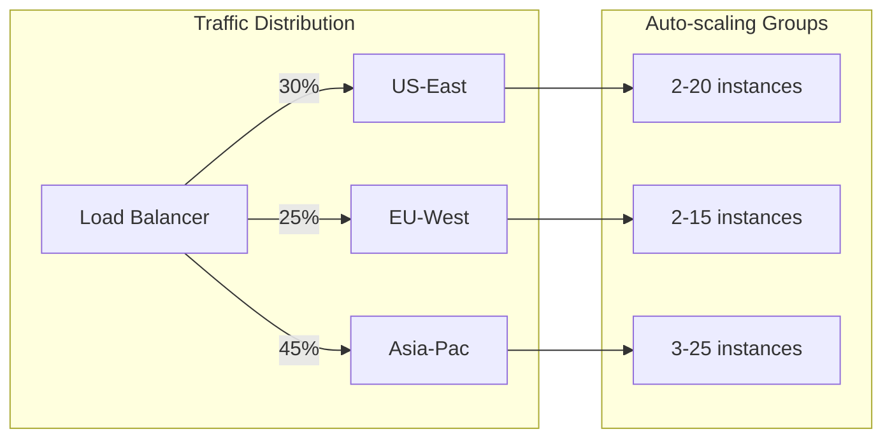

### 8.3 Reliability

#### Availability Targets
| Service Level | Target | Measurement Period | Allowed Downtime |
|---------------|--------|-------------------|------------------|
| Core Dictionary | 99.5% | Monthly | 3.6 hours |
| AI Features | 99.0% | Monthly | 7.2 hours |
| Sync Service | 99.9% | Monthly | 43 minutes |

#### Failure Recovery
| Failure Type | Detection Time | Recovery Time (RTO) | Data Loss (RPO) | Automation |
|--------------|----------------|--------------------|-----------------|-|
| Server crash | <30s | <2min | 0 | Full |
| Database failure | <1min | <5min | <1min | Full |
| Region outage | <2min | <5min | 0 | Full |
| Cache failure | Instant | Instant (fallback) | N/A | Full |
| AI service failure | <30s | Graceful degradation | N/A | Full |

#### Resilience Patterns
```python
# Circuit Breaker Implementation
class CircuitBreaker:
    def __init__(self, failure_threshold=5, timeout=60, half_open_max=3):
        self.failure_threshold = failure_threshold
        self.timeout = timeout
        self.half_open_max = half_open_max
        self.failures = 0
        self.last_failure = None
        self.state = "CLOSED"  # CLOSED, OPEN, HALF_OPEN
        
    async def call(self, func, *args, **kwargs):
        if self.state == "OPEN":
            if time.time() - self.last_failure > self.timeout:
                self.state = "HALF_OPEN"
                self.half_open_calls = 0
            else:
                raise CircuitOpenError("Circuit breaker is OPEN")
        
        try:
            result = await func(*args, **kwargs)
            if self.state == "HALF_OPEN":
                self.half_open_calls += 1
                if self.half_open_calls >= self.half_open_max:
                    self.state = "CLOSED"
                    self.failures = 0
            return result
            
        except Exception as e:
            self.failures += 1
            self.last_failure = time.time()
            
            if self.failures >= self.failure_threshold:
                self.state = "OPEN"
                
            raise e

# Retry with Exponential Backoff
async def robust_api_call(word: str, max_retries=3):
    breaker = CircuitBreaker()
    
    for attempt in range(max_retries):
        try:
            # Try primary service
            return await breaker.call(primary_service.lookup, word)
        except CircuitOpenError:
            # Fallback to cache
            cached = await cache.get(word)
            if cached:
                return cached
            # Try secondary service
            try:
                return await secondary_service.lookup(word)
            except Exception:
                if attempt == max_retries - 1:
                    raise
                await asyncio.sleep(2 ** attempt * 0.1)  # Exponential backoff
```

### 8.4 Availability Patterns

#### Multi-Region Active-Active
```yaml
regions:
  us-east-1:
    role: primary
    capacity: 40%
    services: [all]
    
  eu-west-1:
    role: secondary
    capacity: 30%
    services: [all]
    
  ap-southeast-1:
    role: secondary
    capacity: 30%
    services: [all]
    
failover:
  detection: health_checks
  trigger: 2_consecutive_failures
  duration: automatic_recovery
  dns_ttl: 60s
```

#### Health Check Configuration
```json
{
  "health_checks": {
    "shallow": {
      "endpoint": "/health",
      "interval": "10s",
      "timeout": "2s",
      "healthy_threshold": 2,
      "unhealthy_threshold": 2
    },
    "deep": {
      "endpoint": "/health/deep",
      "interval": "30s",
      "timeout": "5s",
      "checks": [
        "database_connection",
        "cache_connection",
        "disk_space",
        "memory_usage",
        "api_key_validity"
      ]
    }
  }
}
```

### 8.5 Maintainability

#### Code Quality Metrics
| Metric | Target | Tool | Enforcement |
|--------|--------|------|-------------|
| Test Coverage | >80% | Jest/Go test | CI gate |
| Code Complexity | <10 | SonarQube | PR review |
| Documentation | 100% public APIs | Swagger/JSDoc | CI check |
| Type Coverage | 100% | TypeScript | Compiler |
| Linting | Zero warnings | ESLint/golint | Pre-commit |

#### Operational Maintainability
| Aspect | Implementation | Tool/Method |
|--------|----------------|-------------|
| Deployment | One-click | GitHub Actions |
| Rollback | <2 minutes | Blue-green swap |
| Debugging | Distributed tracing | Jaeger |
| Log Access | Centralized | CloudWatch Insights |
| Metrics | Real-time dashboards | Grafana |
| Alerts | Smart grouping | PagerDuty |

#### Technical Debt Management
```yaml
technical_debt:
  tracking: GitHub Issues with 'tech-debt' label
  budget: 20% of sprint capacity
  review: Monthly architecture review
  
  categories:
    - performance: "Response time degradation"
    - security: "Outdated dependencies"
    - scalability: "Single points of failure"
    - maintainability: "Code duplication"
    
  prioritization:
    P0: Security vulnerabilities
    P1: Performance impacts >10%
    P2: Developer velocity impacts
    P3: Code quality improvements
```

### 8.6 Observability

#### Three Pillars of Observability

**1. Metrics**
```yaml
business_metrics:
  - words_looked_up_per_minute
  - unique_users_per_hour
  - cache_hit_ratio
  - ai_feature_usage_rate
  
technical_metrics:
  - response_time_percentiles
  - error_rate_by_endpoint
  - database_query_duration
  - memory_usage_by_service
```

**2. Logs**
```json
{
  "timestamp": "2024-01-01T12:00:00Z",
  "level": "INFO",
  "service": "dictionary-api",
  "trace_id": "abc123",
  "user_id": "user_456",
  "event": "word_lookup",
  "word": "example",
  "cache_hit": true,
  "response_time_ms": 23,
  "context": {
    "source": "desktop_app",
    "version": "1.2.3"
  }
}
```

**3. Traces**
```yaml
trace_example:
  trace_id: "abc123"
  total_duration: 150ms
  spans:
    - name: "api_gateway"
      duration: 5ms
    - name: "cache_lookup"
      duration: 2ms
      result: "miss"
    - name: "database_query"
      duration: 45ms
    - name: "context_analysis"
      duration: 90ms
      parallel: true
    - name: "response_formatting"
      duration: 8ms
```

### 8.7 Performance Optimization Strategies

#### Client-Side Optimizations
1. **Predictive Prefetching**
   - Analyze reading patterns
   - Prefetch words near cursor
   - ML-based prediction model

2. **Progressive Rendering**
   - Show cached content immediately
   - Update with fresh data async
   - Skeleton loading states

3. **Resource Prioritization**
   - Critical CSS inline
   - Lazy load images
   - Code splitting by feature

#### Server-Side Optimizations
1. **Query Optimization**
   - Prepared statements
   - Connection pooling
   - Read replicas for search

2. **Caching Strategy**
   - Warm cache on deploy
   - Predictive cache warming
   - Edge caching for static

3. **Resource Management**
   - CPU affinity for services
   - Memory limits per request
   - Graceful degradation
---

## 9. Implementation Plan

### 9.1 Development Phases

#### Phase 1: Foundation & Core Experience (Weeks 1-8)
**Goal**: Build the absolute core that makes users say "wow, this is fast!"

**Scope**:
- Tauri desktop app with hotkey capture
- Basic popup UI with beautiful design
- Memory cache for instant responses
- Simple REST API for definitions
- Support for top 10,000 English words
- Offline capability for cached words

**Success Criteria**:
- <50ms popup response time achieved
- Hotkey works across all major applications
- Zero crashes in 1-hour usage session
- UI feels native on Windows and macOS

#### Phase 2: Intelligence Layer (Weeks 9-16)
**Goal**: Make the dictionary understand context and feel smart

**Scope**:
- Context analysis with BERT integration
- Multi-definition ranking by relevance
- Clickable cross-references within definitions
- Smart prefetching based on reading patterns
- Basic user accounts and preferences
- Performance optimization for scale

**Success Criteria**:
- Context analysis improves definition accuracy by 40%
- Cross-reference clicks work instantly
- 80% cache hit rate achieved
- Support for 100 concurrent users

#### Phase 3: Language Expansion (Weeks 17-24)
**Goal**: Become the most comprehensive multilingual dictionary

**Scope**:
- Add 10 major languages for translations
- Batch translation pipeline with LLM
- Language detection for automatic switching
- Wikipedia integration (English first)
- Sync service for notes across devices
- Enhanced caching strategy

**Success Criteria**:
- All translations feel natural, not robotic
- Wikipedia summaries load within 2 seconds
- Sync works seamlessly across 2+ devices
- Support for 50,000+ word vocabulary

#### Phase 4: AI Enhancement (Weeks 25-32)
**Goal**: Add AI features that genuinely help users learn

**Scope**:
- AI summarization for long texts
- Smart explanations for complex words
- Etymology and word relationships
- Learning insights and progress tracking
- DeepSeek API integration
- Advanced context understanding

**Success Criteria**:
- AI features used by >30% of active users
- Summarization completes in <3 seconds
- AI responses feel helpful, not generic
- System handles 1000 req/s

#### Phase 5: Platform Maturity (Weeks 33-40)
**Goal**: Polish for public launch and sustainable growth

**Scope**:
- Performance optimization across the board
- Plugin architecture for extensibility
- Advanced analytics and insights
- Premium features and billing
- Global CDN deployment
- Comprehensive monitoring

**Success Criteria**:
- 99.5% uptime achieved
- <100ms response globally
- Plugin API documented and stable
- Payment system fully functional
- Ready for 100k+ users

#### Phase 6: Ecosystem Building (Weeks 41+)
**Goal**: Create a platform others want to build on

**Scope**:
- Public API for developers
- Browser extension
- Mobile app planning
- Community features
- Advanced learning tools
- Integration partnerships

**Success Criteria**:
- 10+ third-party integrations
- API used by external developers
- Community contributing content
- Sustainable business model proven

### 9.2 Milestones & Deliverables

| Milestone | Target Week | Key Deliverables | Success Metrics |
|-----------|-------------|------------------|-----------------|
| **M1: Proof of Concept** | Week 4 | Working hotkey popup, Basic UI, Memory cache | <100ms response time |
| **M2: Alpha Release** | Week 8 | Offline-capable app, 10k words, Beautiful UI | Friends/family love it |
| **M3: Smart Dictionary** | Week 16 | Context analysis, Cross-references, Prefetching | 40% better accuracy |
| **M4: Multilingual** | Week 24 | 10 languages, Wikipedia, Sync | Natural translations |
| **M5: AI-Powered** | Week 32 | AI features, Analytics, Premium features | 30% feature adoption |
| **M6: Public Launch** | Week 40 | Production ready, Monitoring, Support | 99.5% uptime |
| **M7: Platform** | Week 48 | API, Plugins, Ecosystem | External adoption |

### 9.3 Team Structure

```
Founder/Tech Lead (Solo initially)
├── Phase 1-2: Solo Development
│   └── Focus: Core experience
│
├── Phase 3: First Hire
│   └── Backend Developer (Part-time)
│       └── Focus: API scaling, languages
│
├── Phase 4: Team Expansion
│   ├── Full-stack Developer
│   │   └── Focus: AI features, performance
│   └── DevOps Engineer (Contract)
│       └── Focus: Infrastructure, monitoring
│
├── Phase 5: Full Team
│   ├── Backend Team (2)
│   │   ├── Senior Backend Dev
│   │   └── Backend Developer
│   ├── Frontend Developer
│   │   └── Focus: UI polish, plugins
│   ├── ML Engineer (Part-time)
│   │   └── Focus: Context analysis, AI
│   └── QA/Support (1)
│       └── Focus: Quality, user feedback
│
└── Phase 6: Scaling Team
    ├── Engineering Manager
    ├── Backend Team (3)
    ├── Frontend Team (2)
    ├── ML Team (2)
    ├── DevOps (1)
    ├── QA Team (2)
    └── Developer Relations (1)
```

### 9.4 Risk Mitigation by Phase

| Phase | Key Risks | Mitigation Strategy |
|-------|-----------|-------------------|
| **Phase 1** | Hotkey conflicts, Performance issues | Extensive testing, Multiple implementation approaches |
| **Phase 2** | ML model too slow, Context accuracy | Use lightweight models, Fallback strategies |
| **Phase 3** | Translation quality, Sync conflicts | Human validation, CRDT architecture |
| **Phase 4** | AI API costs, Feature complexity | Cost caps, Progressive rollout |
| **Phase 5** | Scaling issues, Technical debt | Load testing, Refactoring sprints |
| **Phase 6** | Platform stability, Developer adoption | Comprehensive docs, Developer outreach |


### 9.6 Technology Evolution

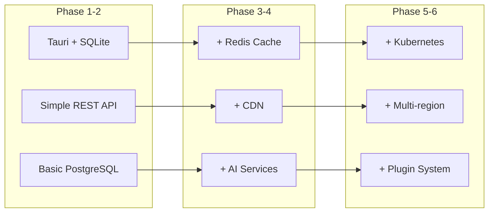

### 9.7 Success Metrics Evolution

| Metric | Phase 1 | Phase 2 | Phase 3 | Phase 4 | Phase 5 | Phase 6 |
|--------|---------|---------|---------|---------|---------|---------|
| Response Time | <100ms | <50ms | <50ms | <40ms | <30ms | <30ms |
| Daily Users | 10 | 100 | 1k | 10k | 50k | 100k+ |
| Word Coverage | 10k | 10k | 50k | 100k | 200k | 500k+ |
| Languages | 1 | 1 | 11 | 11 | 15 | 20+ |
| Uptime | 95% | 97% | 98% | 99% | 99.5% | 99.9% |
| Revenue | $0 | $0 | $0 | $1k/mo | $10k/mo | $50k+/mo |
---

## 10. Testing Strategy
# Testing Integration by Development Phase

## Phase 1: Foundation & Core Experience (Weeks 1-8)
**Testing Focus**: Get the basics bulletproof

### Tests to Implement:
- **Unit Tests (60% coverage)**:
  - Hotkey capture logic
  - Cache operations
  - Basic API endpoints
  
- **Integration Tests**:
  - Desktop app ↔ API communication
  - Cache hit/miss scenarios
  
- **Manual Testing**:
  - Hotkey works in different applications
  - UI renders correctly on Windows/Mac
  - Response time measurement

### Testing Tools Setup:
```yaml
phase_1_testing:
  frontend:
    - Vitest for React components
    - Manual testing for Tauri integration
  backend:
    - Go test for API
    - Postman collection for endpoints
  performance:
    - Simple response time logging
    - Manual stopwatch testing
```

## Phase 2: Intelligence Layer (Weeks 9-16)
**Testing Focus**: Ensure smart features work reliably

### New Tests Added:
- **Unit Tests (75% coverage)**:
  - Context analysis algorithms
  - Definition ranking logic
  - Prefetching decisions
  
- **Integration Tests**:
  - BERT model integration
  - Cross-reference navigation
  - User preference storage
  
- **E2E Tests (Introduction)**:
  - Basic user workflows
  - Context selection → correct definition

### Testing Expansion:
```yaml
phase_2_testing:
  ml_testing:
    - Accuracy benchmarks for context analysis
    - Performance tests for BERT inference
  e2e_introduction:
    - Playwright for basic workflows
    - 5 critical user journeys
  performance:
    - K6 scripts for load testing (100 users)
```

## Phase 3: Language Expansion (Weeks 17-24)
**Testing Focus**: Multilingual accuracy and sync reliability

### New Tests Added:
- **Unit Tests (80% coverage)**:
  - Translation quality checks
  - Language detection
  - Sync conflict resolution
  
- **Integration Tests**:
  - Multi-language API calls
  - Wikipedia integration
  - Cross-device sync
  
- **Acceptance Tests**:
  - All user stories validation
  - Language-specific edge cases

### Quality Gates:
```yaml
phase_3_testing:
  translation_quality:
    - Native speaker validation
    - Automated quality metrics
  sync_testing:
    - Conflict resolution scenarios
    - Offline/online transitions
  performance:
    - K6 expanded to 1000 users
    - Multi-region latency tests
```

## Phase 4: AI Enhancement (Weeks 25-32)
**Testing Focus**: AI reliability and performance

### New Tests Added:
- **AI-Specific Tests**:
  - Response quality validation
  - Timeout handling
  - Fallback mechanisms
  
- **Security Tests (Introduction)**:
  - API key encryption
  - Rate limiting
  - Input sanitization
  
- **Load Tests**:
  - AI service under load
  - Cost monitoring

### Advanced Testing:
```yaml
phase_4_testing:
  ai_quality:
    - Output relevance scoring
    - Response time distribution
  security_introduction:
    - OWASP ZAP basic scans
    - Dependency vulnerability checks
  chaos_testing:
    - AI service failures
    - Network degradation
```

## Phase 5: Platform Maturity (Weeks 33-40)
**Testing Focus**: Production readiness

### Complete Test Suite:
- **Unit Tests (85% coverage)**
- **Integration Tests (75% coverage)**
- **E2E Tests (All workflows)**
- **Performance Tests (Full suite)**
- **Security Tests (Comprehensive)**

### Production Testing:
```yaml
phase_5_testing:
  full_automation:
    - CI/CD pipeline complete
    - Automated regression suite
  production_testing:
    - Blue-green deployment tests
    - Rollback procedures
    - Monitoring validation
  stress_testing:
    - 10k concurrent users
    - Sustained load tests
```

## Phase 6: Ecosystem Building (Weeks 41+)
**Testing Focus**: API stability and partner integration

### New Testing Areas:
- **API Contract Tests**
- **Plugin Integration Tests**
- **Backward Compatibility Tests**
- **Developer Experience Tests**

### Ecosystem Testing:
```yaml
phase_6_testing:
  api_testing:
    - Contract testing with Pact
    - Version compatibility matrix
  plugin_testing:
    - Plugin loading/unloading
    - Security sandboxing
  community_testing:
    - Beta testing program
    - Feedback integration
```

---

## Testing Evolution Summary

| Phase | Test Coverage | Test Types | Focus Area | Automation Level |
|-------|---------------|------------|------------|------------------|
| 1 | 60% unit | Manual + Basic | Core functionality | 20% |
| 2 | 75% unit | + Integration, E2E intro | Smart features | 40% |
| 3 | 80% unit | + Acceptance, Multi-region | Languages & Sync | 60% |
| 4 | 80% unit | + Security, AI tests | AI reliability | 75% |
| 5 | 85% unit | + Full suite | Production ready | 90% |
| 6 | 85% unit | + Contract, Plugin | Ecosystem | 95% |

## Key Principles

1. **Test as You Build**: Never wait until the end of a phase
2. **Automate Gradually**: Start manual, automate what's repetitive
3. **Focus on User Impact**: Test what users care about first
4. **Performance from Day 1**: Measure response times from the start
5. **Security When It Matters**: Introduce security testing when handling user data


---

## 11. Deployment & Operations

### 11.1 Deployment Architecture

```
Production Environment (Multi-Region Active-Active)
├── Global Load Balancer (Route 53 + CloudFront)
│   ├── US-East Region
│   │   ├── ALB (Application Load Balancer)
│   │   ├── ECS Cluster
│   │   │   ├── API Service (3-20 tasks)
│   │   │   ├── Context Service (2-10 tasks)
│   │   │   └── Sync Service (2-5 tasks)
│   │   ├── RDS PostgreSQL (Primary)
│   │   ├── ElastiCache Redis Cluster
│   │   └── S3 (User Data)
│   │
│   ├── EU-West Region
│   │   ├── ALB
│   │   ├── ECS Cluster (Similar setup)
│   │   ├── RDS PostgreSQL (Read Replica)
│   │   └── ElastiCache Redis Cluster
│   │
│   └── AP-Southeast Region
│       ├── ALB
│       ├── ECS Cluster (Similar setup)
│       ├── RDS PostgreSQL (Read Replica)
│       └── ElastiCache Redis Cluster
│
└── Shared Services
    ├── CloudWatch (Monitoring)
    ├── Lambda (Async jobs)
    ├── SQS (Message queuing)
    └── Secrets Manager
```

### 11.2 CI/CD Pipeline

```mermaid
graph LR
    subgraph "Development"
        Dev[Developer] -->|git push| GH[GitHub]
    end
    
    subgraph "CI Pipeline"
        GH -->|webhook| GHA[GitHub Actions]
        GHA --> Lint[Linting]
        Lint --> Test[Unit Tests]
        Test --> Build[Build Images]
        Build --> Scan[Security Scan]
        Scan --> IntTest[Integration Tests]
    end
    
    subgraph "CD Pipeline"
        IntTest -->|success| Stage[Deploy Staging]
        Stage --> E2E[E2E Tests]
        E2E --> Perf[Performance Tests]
        Perf -->|approval| Canary[Canary Deploy]
        Canary -->|metrics ok| Prod[Full Production]
    end
    
    subgraph "Rollback"
        Prod -->|issues| RB[Auto Rollback]
        RB -->|revert| Stage
    end
```

#### Detailed Pipeline Configuration
```yaml
name: Deploy Pipeline
on:
  push:
    branches: [main]

jobs:
  test:
    runs-on: ubuntu-latest
    strategy:
      matrix:
        service: [api, context, sync]
    steps:
      - uses: actions/checkout@v3
      - name: Run tests
        run: make test-${{ matrix.service }}
      
  build:
    needs: test
    runs-on: ubuntu-latest
    steps:
      - name: Build and push Docker images
        run: |
          docker build -t dictionary-$SERVICE:$GITHUB_SHA .
          docker push dictionary-$SERVICE:$GITHUB_SHA
          
  deploy-staging:
    needs: build
    environment: staging
    steps:
      - name: Deploy to ECS Staging
        run: |
          aws ecs update-service \
            --cluster staging \
            --service $SERVICE \
            --force-new-deployment
            
  deploy-production:
    needs: deploy-staging
    environment: production
    steps:
      - name: Canary deployment (10%)
        run: |
          aws ecs update-service \
            --cluster production \
            --service $SERVICE \
            --deployment-configuration "type=CANARY,canary={percentage=10,interval=5m}"
            
      - name: Monitor canary metrics
        run: |
          ./scripts/check-canary-health.sh
          
      - name: Full deployment
        if: success()
        run: |
          aws ecs update-service \
            --cluster production \
            --service $SERVICE \
            --deployment-configuration "type=LINEAR,linear={percentage=20,interval=2m}"
```

### 11.3 Operational Procedures

- **Monitoring Dashboard**:
  - **Primary**: Grafana at `https://monitoring.dictionary.internal`
  - **Dashboards**: 
    - System Overview (CPU, Memory, Network)
    - API Performance (Latency, Errors, Throughput)
    - Business Metrics (Lookups, Users, Features)
    - Cost Tracking (AWS spend by service)

- **Runbook Location**:
  - **Wiki**: `https://wiki.dictionary.internal/runbooks`
  - **Key Runbooks**:
    ```
    ├── incident-response.md
    ├── deployment-rollback.md
    ├── database-failover.md
    ├── cache-failure-recovery.md
    ├── scaling-procedures.md
    └── security-breach-response.md
    ```

- **On-call Schedule**:
  ```yaml
  on_call_rotation:
    schedule: weekly
    handoff: Monday 10am UTC
    team_size: 4 engineers (once team grows)
    
    escalation:
      L1: Primary on-call (5 min)
      L2: Secondary on-call (15 min)
      L3: Team lead (30 min)
      L4: CTO/Founder (45 min)
    
    severity_levels:
      P0: Complete outage - 15 min response
      P1: Degraded service - 30 min response
      P2: Feature broken - 2 hour response
      P3: Minor issue - next business day
  ```

### 11.4 Operational Automation

```yaml
automated_operations:
  - auto_scaling:
      trigger: CPU > 70% or response_time > 100ms
      action: scale_out
      cooldown: 300s
      
  - auto_healing:
      trigger: health_check_failures > 2
      action: restart_task
      
  - backup_automation:
      database: daily snapshots, 30 day retention
      user_data: continuous to S3
      
  - certificate_renewal:
      provider: Let's Encrypt
      automation: 30 days before expiry
      
  - cost_optimization:
      unused_resources: daily cleanup
      reserved_instances: quarterly review
```

### 11.5 Disaster Recovery

| Component | RTO | RPO | Backup Strategy | Recovery Method |
|-----------|-----|-----|-----------------|-----------------|
| Database | 30 min | 5 min | Multi-region replicas | Automated failover |
| User Data | 15 min | 0 min | S3 cross-region | Eventual consistency |
| API Services | 5 min | N/A | Multi-region active | DNS failover |
| Cache | Instant | N/A | Graceful degradation | Auto-rebuild |

### 11.6 Monitoring and Alerting

```yaml
monitoring_stack:
  metrics:
    - CloudWatch: AWS resources
    - Prometheus: Application metrics
    - Custom: Business metrics
    
  logs:
    - CloudWatch Logs: Centralized logging
    - Log retention: 30 days hot, 1 year cold
    
  alerts:
    channels:
      - PagerDuty: P0/P1 incidents
      - Slack: P2/P3 issues
      - Email: Daily summaries
    
    key_alerts:
      - response_time > 100ms for 5 minutes
      - error_rate > 1% for 3 minutes
      - disk_usage > 80%
      - cache_hit_rate < 70%
      - deployment_failure
```
---
## 12. Risk Analysis

### 12.1 Technical Risks

| Risk | Probability | Impact | Mitigation Strategy | Contingency Plan |
|------|-------------|--------|-------------------|------------------|
| **Hotkey conflicts with OS/apps** | High | High | - Test on 50+ popular apps<br>- Multiple hotkey options<br>- Customizable bindings | - Fallback to system tray<br>- Browser extension backup |
| **Sub-50ms performance not achievable** | Medium | High | - Aggressive caching strategy<br>- Performance budget from day 1<br>- GPU acceleration | - Adjust target to 100ms<br>- Progressive enhancement |
| **BERT model too slow for real-time** | Medium | Medium | - Use DistilBERT (40% size)<br>- Model quantization<br>- Edge deployment | - Simple keyword matching<br>- Async context analysis |
| **Cache memory bloat** | Medium | Medium | - LRU eviction policy<br>- Configurable cache size<br>- Memory monitoring | - Disk-based cache<br>- Reduce cache size |
| **Cross-platform compatibility issues** | High | Medium | - Tauri abstractions<br>- Platform-specific code paths<br>- Extensive testing | - Platform-specific builds<br>- Reduced feature set |
| **API rate limiting by Wikipedia** | High | Low | - Aggressive caching<br>- Request batching<br>- Multiple API keys | - Fallback to summaries<br>- User notifications |
| **Database scaling bottleneck** | Low | High | - Read replicas early<br>- Connection pooling<br>- Query optimization | - Emergency scaling<br>- Cache-only mode |
| **AI API costs explosion** | Medium | High | - Cost caps per user<br>- Efficient prompt design<br>- Response caching | - Switch providers<br>- Local model fallback |

### 12.2 Business Risks

| Risk | Probability | Impact | Mitigation Strategy | Contingency Plan |
|------|-------------|--------|-------------------|------------------|
| **Slow user adoption** | Medium | High | - Focus on core value (speed)<br>- Word-of-mouth features<br>- Free tier generous | - Pivot to B2B<br>- Browser extension |
| **Competitor with more resources** | High | Medium | - Build moat with UX<br>- Community features<br>- Move fast | - Open source core<br>- Partnership options |
| **Dictionary licensing issues** | Low | Critical | - Build own dataset<br>- Multiple sources<br>- Legal review | - Remove content<br>- License negotiation |
| **Running out of runway** | Medium | Critical | - Revenue from month 6<br>- Keep burn low<br>- Part-time initially | - Raise funding<br>- Reduce scope |
| **Key developer departure** | Low | High | - Documentation culture<br>- Code simplicity<br>- Knowledge sharing | - Contractor backup<br>- Reduced features |
| **DeepSeek API shutdown** | Low | Medium | - Multiple AI providers<br>- Abstract interface<br>- Local model ready | - Switch providers<br>- Degrade gracefully |
| **User data breach** | Low | Critical | - Security first design<br>- Minimal data storage<br>- Encryption everywhere | - Incident response<br>- User notification<br>- Legal compliance |

### 12.3 Operational Risks

| Risk | Probability | Impact | Mitigation Strategy | Contingency Plan |
|------|-------------|--------|-------------------|------------------|
| **Cloud provider outage** | Low | High | - Multi-region deployment<br>- Provider redundancy<br>- Graceful degradation | - Failover procedures<br>- Status page<br>- Cache-only mode |
| **DDoS attack** | Medium | Medium | - CloudFlare protection<br>- Rate limiting<br>- Auto-scaling | - Emergency blocking<br>- Increase capacity<br>- Law enforcement |
| **Data corruption** | Low | High | - Backup strategy<br>- Data validation<br>- Version control | - Point-in-time recovery<br>- Manual fixes<br>- User notification |
| **Deployment failure** | Medium | Low | - Blue-green deployment<br>- Automated rollback<br>- Canary releases | - Manual rollback<br>- Previous version<br>- Hotfix process |
| **Monitoring blind spots** | Medium | Medium | - Comprehensive metrics<br>- User feedback loop<br>- Synthetic monitoring | - Manual checks<br>- User reports<br>- Add monitoring |

### 12.4 Risk Matrix Visualization

```
Impact →
Critical |  Dictionary    User Data    Runway
         |  Licensing     Breach       Out
         |
High     |  Hotkey       Performance   Database   Developer
         |  Conflicts    Target        Scaling    Departure
         |
Medium   |  BERT Speed   Competitor    DeepSeek   DDoS
         |  Cache Bloat  Entry         Shutdown   Attack
         |
Low      |  Wikipedia    Deployment    
         |  Limits       Failure       
         |________________________________________________
            Low          Medium         High      Probability →
```

### 12.5 Risk Mitigation Timeline

| Phase | Primary Risk Focus | Mitigation Priority |
|-------|-------------------|---------------------|
| **Phase 1** | Technical fundamentals | Hotkey conflicts, Performance |
| **Phase 2** | Scaling issues | BERT performance, Cache management |
| **Phase 3** | Data integrity | Sync conflicts, Language quality |
| **Phase 4** | Cost control | AI API costs, Infrastructure spend |
| **Phase 5** | Security & Reliability | Data protection, Uptime |
| **Phase 6** | Business sustainability | Revenue, Competition |

### 12.6 Early Warning Indicators

```yaml
technical_indicators:
  - response_time_p95 > 80ms: Performance risk increasing
  - cache_hit_rate < 70%: Scaling issues ahead
  - memory_usage > 150MB: Resource optimization needed
  - error_rate > 0.5%: Stability concerns

business_indicators:
  - daily_active_users growth < 10%/month: Adoption risk
  - churn_rate > 20%: Product-market fit issues
  - support_tickets > 50/day: Quality problems
  - infrastructure_cost > $1000/month: Burn rate risk

operational_indicators:
  - deployment_frequency < 1/week: Velocity dropping
  - rollback_rate > 10%: Quality issues
  - incident_frequency > 2/month: Reliability concerns
  - on_call_burnout: Team health risk
```

### 12.7 Risk Response Strategies

#### For High Probability + High Impact Risks:

**1. Hotkey Conflicts**
```yaml
proactive_measures:
  - week_1: Research top 100 Windows/Mac applications
  - week_2: Build hotkey testing framework
  - week_3: Implement multiple hotkey options
  - week_4: Create conflict detection system

fallback_options:
  - System tray icon with right-click
  - Floating widget option
  - Browser extension for web reading
  - Mobile app companion
```

**2. Performance Target Miss**
```yaml
optimization_ladder:
  - level_1: In-memory cache (target: <30ms)
  - level_2: Predictive prefetching (target: <20ms)
  - level_3: Edge computing (target: <50ms global)
  - level_4: Adjusted expectations (communicate openly)
```

### 12.8 Risk Budget Allocation

| Risk Category | Budget Allocation | Justification |
|---------------|------------------|---------------|
| Technical Risks | 40% | Core product quality |
| Security Risks | 25% | User trust critical |
| Business Risks | 20% | Market dynamics |
| Operational Risks | 15% | Can recover quickly |

### 12.9 Risk Review Process

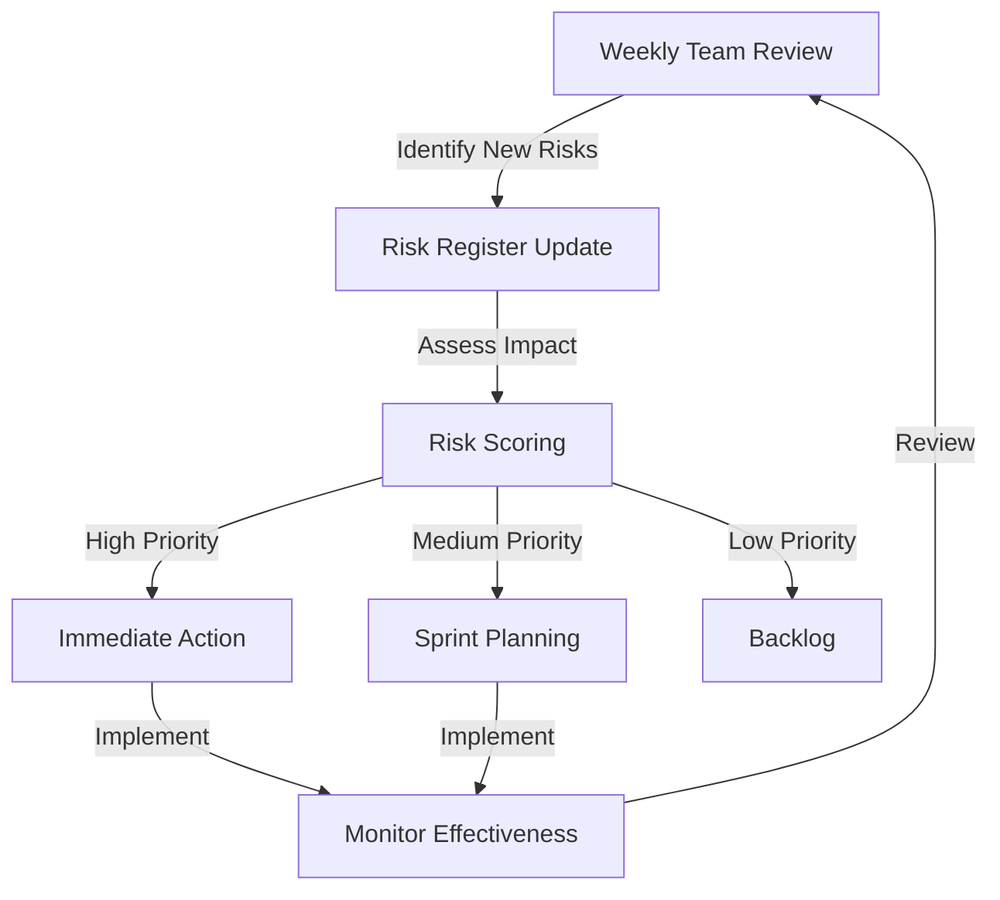

### 12.10 Crisis Management Protocol

```yaml
incident_levels:
  P0_total_outage:
    response_time: 15 minutes
    team: All hands
    communication: Status page + Twitter + Email
    
  P1_major_degradation:
    response_time: 30 minutes
    team: On-call + Team lead
    communication: Status page + In-app notice
    
  P2_feature_failure:
    response_time: 2 hours
    team: On-call engineer
    communication: Status page
    
  P3_minor_issue:
    response_time: Next business day
    team: Assigned developer
    communication: Internal only

post_incident:
  - timeline: Document within 24 hours
  - root_cause: Analyze within 48 hours
  - postmortem: Publish within 1 week
  - action_items: Implement within sprint
```

---
## 13. Documentation Plan

### 13.1 Architecture Documentation

#### Architecture Decision Records (ADRs)
```yaml
adr_template:
  number: ADR-001
  title: "Use Tauri instead of Electron"
  status: Accepted
  context: "Need cross-platform desktop app with small footprint"
  decision: "Use Tauri for 30MB size vs 150MB Electron"
  consequences: 
    positive: "Smaller size, better performance, native feel"
    negative: "Smaller community, fewer examples"
  date: "2024-01-15"
```

**Key ADRs to Document:**
- [ ] ADR-001: Tauri vs Electron for desktop framework
- [ ] ADR-002: REST vs GraphQL for initial API
- [ ] ADR-003: PostgreSQL vs specialized dictionary database
- [ ] ADR-004: Monorepo vs multi-repo structure
- [ ] ADR-005: BERT model selection for context analysis
- [ ] ADR-006: Redis vs Memcached for caching layer
- [ ] ADR-007: AWS vs GCP vs Azure for cloud provider
- [ ] ADR-008: CRDT vs traditional sync for user data

#### Component Diagrams
- [ ] **System Context Diagram** (C4 Level 1)
  - Users, external systems, main system
- [ ] **Container Diagram** (C4 Level 2)
  - Desktop app, API, databases, services
- [ ] **Component Diagrams** (C4 Level 3)
  - Internal structure of each service
- [ ] **Deployment Diagram**
  - Infrastructure, regions, scaling groups

#### Sequence Diagrams
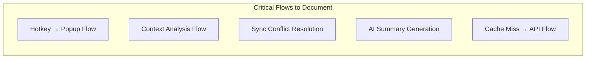

### 13.2 API Documentation

#### OpenAPI/Swagger Specifications
```yaml
openapi: 3.0.0
info:
  title: Dictionary API
  version: 1.0.0
  description: Lightning-fast dictionary lookups

paths:
  /api/v1/define/{word}:
    get:
      summary: Get word definition
      parameters:
        - name: word
          in: path
          required: true
          schema:
            type: string
      responses:
        200:
          description: Definition found
          content:
            application/json:
              schema:
                $ref: '#/components/schemas/Definition'
```

**API Documentation Structure:**
- [ ] **Getting Started Guide**
  - Authentication setup
  - Rate limits
  - Basic examples
- [ ] **Endpoint Reference**
  - Full OpenAPI spec
  - Request/response examples
  - Error codes
- [ ] **Integration Guides**
  - SDK quickstarts
  - Common use cases
  - Best practices
- [ ] **Changelog**
  - Version history
  - Breaking changes
  - Migration guides

### 13.3 Operational Runbooks

#### Runbook Template
```markdown
# Runbook: High Memory Usage Alert

## Overview
Handles situations where application memory exceeds 80% threshold

## Severity: P2

## Prerequisites
- Access to monitoring dashboard
- SSH access to servers
- PagerDuty account

## Detection
- Alert: "Memory usage > 80% for 5 minutes"
- Dashboard: https://monitoring.internal/memory

## Investigation Steps
1. Check Grafana dashboard for memory trends
2. SSH to affected server
3. Run `htop` to identify process
4. Check for memory leaks: `pmap -x <pid>`

## Resolution Steps
1. If cache overflow:
   - Restart Redis: `sudo systemctl restart redis`
2. If application leak:
   - Trigger garbage collection
   - Rolling restart if needed
3. If traffic spike:
   - Scale horizontally
   - Enable rate limiting

## Verification
- Memory usage returns below 70%
- No user impact reported
- All health checks passing
```

**Essential Runbooks:**
- [ ] **Deployment Procedures**
  - Standard deployment
  - Emergency hotfix
  - Rollback process
  - Database migration
- [ ] **Incident Response**
  - Service outage
  - Performance degradation  
  - Security incident
  - Data corruption
- [ ] **Troubleshooting Guides**
  - High latency investigation
  - Cache failures
  - Sync conflicts
  - AI service errors
- [ ] **Disaster Recovery**
  - Region failover
  - Database recovery
  - Full system restore
  - Data recovery

### 13.4 User Documentation

#### End User Documentation
- [ ] **Quick Start Guide** (1 page)
  ```markdown
  # Dictionary in 30 Seconds
  1. Download from [website]
  2. Install (double-click)
  3. Select any text
  4. Press Ctrl+D (customizable)
  5. See instant definition!
  ```

- [ ] **User Manual**
  - Installation guide (Windows/Mac/Linux)
  - Feature walkthrough with screenshots
  - Customization options
  - Keyboard shortcuts
  - Troubleshooting FAQ

- [ ] **Video Tutorials**
  - 2-minute setup video
  - Feature highlights
  - Power user tips
  - Language learning workflows

#### Admin Documentation
- [ ] **Configuration Guide**
  - Settings explanation
  - Performance tuning
  - Cache management
  - Privacy options

- [ ] **API Usage Guide**
  - Authentication setup
  - Rate limit management
  - Webhook configuration
  - Usage analytics

### 13.5 Developer Documentation

#### Code Documentation Standards
```javascript
/**
 * Retrieves word definition with context-aware ranking
 * @param {string} word - The word to define
 * @param {string} context - Optional surrounding text (50 words)
 * @param {object} options - Configuration options
 * @param {boolean} options.includeEtymology - Include word origins
 * @param {number} options.maxDefinitions - Maximum definitions to return
 * @returns {Promise<Definition>} Ranked definitions
 * @throws {WordNotFoundError} If word doesn't exist
 * @example
 * const definition = await getDefinition('example', 'This is an example sentence', {
 *   includeEtymology: true,
 *   maxDefinitions: 3
 * });
 */
async function getDefinition(word, context = '', options = {}) {
  // Implementation
}
```

#### Developer Onboarding
- [ ] **Environment Setup** (30 minutes)
  ```bash
  # One-command setup
  git clone https://github.com/dictionary/app
  cd app
  ./scripts/setup-dev.sh
  # You're ready to code!
  ```

- [ ] **Architecture Overview** (1 hour read)
  - System design principles
  - Component interactions
  - Data flow diagrams
  - Technology choices

- [ ] **Contribution Guide**
  - Code style guide
  - Git workflow
  - PR process
  - Testing requirements
  - Documentation requirements

### 13.6 Documentation Maintenance

#### Documentation as Code
```yaml
documentation_pipeline:
  triggers:
    - code_change: Update API docs
    - architecture_change: Update ADRs
    - incident: Update runbooks
    - release: Update user docs
    
  automation:
    - api_docs: Generated from OpenAPI
    - code_docs: Generated from JSDoc/GoDoc
    - changelog: Generated from commits
    - metrics: Auto-update dashboards
```

#### Review Schedule
| Documentation Type | Review Frequency | Owner | Automation |
|-------------------|------------------|--------|------------|
| API Reference | Every PR | Backend lead | OpenAPI generation |
| Runbooks | Monthly | On-call team | Incident updates |
| User Guides | Per release | Product owner | Screenshot tests |
| Architecture | Quarterly | Tech lead | Diagram validation |
| Code Comments | Every PR | Developer | Linting rules |

### 13.7 Documentation Tools & Platform

```yaml
documentation_stack:
  code_docs:
    - JSDoc for JavaScript
    - GoDoc for Go services
    - Sphinx for Python ML code
    
  api_docs:
    - Swagger UI for interactive docs
    - Redoc for beautiful rendering
    - Postman collections for testing
    
  user_docs:
    - Docusaurus for documentation site
    - Loom for video tutorials
    - Intercom for in-app help
    
  internal_docs:
    - Confluence for wiki
    - Mermaid for diagrams
    - draw.io for architecture
    
  hosting:
    - docs.dictionary.app (public)
    - internal.dictionary.app (team)
    - api.dictionary.app/docs (developers)
```

### 13.8 Documentation Quality Metrics

```yaml
quality_metrics:
  coverage:
    - API endpoints documented: 100%
    - Public functions documented: 100%
    - Runbooks for P0/P1 incidents: 100%
    
  freshness:
    - Documentation age < 3 months: 90%
    - Broken links: 0
    - Outdated screenshots: 0
    
  usability:
    - Time to first successful API call: < 10 minutes
    - Developer onboarding time: < 2 hours
    - Support tickets about docs: < 5/month
    
  engagement:
    - Documentation page views/month
    - Video tutorial completion rate
    - API playground usage
```

### 13.9 Documentation Deliverables by Phase

| Phase | Documentation Focus | Deliverables |
|-------|-------------------|--------------|
| **Phase 1** | Core setup | README, basic API docs, dev setup |
| **Phase 2** | Architecture | ADRs, component diagrams, API expansion |
| **Phase 3** | Operations | Runbooks, deployment guides, monitoring |
| **Phase 4** | User guides | Feature docs, video tutorials, FAQ |
| **Phase 5** | Platform | Full API reference, SDK docs, examples |
| **Phase 6** | Ecosystem | Plugin development guide, partner docs |

### 13.10 Knowledge Management

```yaml
knowledge_base:
  structure:
    - /docs
      - /architecture (ADRs, diagrams)
      - /api (OpenAPI, examples)
      - /guides (user, admin, developer)
      - /runbooks (operational procedures)
      - /tutorials (videos, walkthroughs)
    
  search:
    - Full-text search across all docs
    - Tag-based categorization
    - Version-specific filtering
    
  feedback:
    - "Was this helpful?" on every page
    - Comment system for clarifications
    - Monthly documentation survey
    
  continuous_improvement:
    - Track most visited pages
    - Identify documentation gaps
    - Regular user interviews
    - Documentation sprints
```

---


## Document Control

| Version | Date | Author | Changes |
|---------|------|--------|---------|
| 1.0 | 05.07.2025 | Phan Vu | Initial draft |

**Last Updated**: 05.07.2025
**Status**: Approved
**Approvers**: Phan Vu